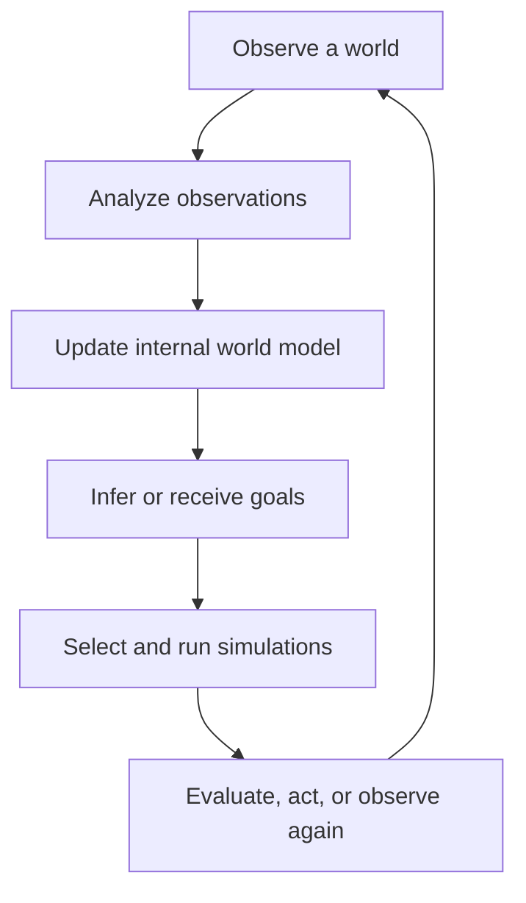

# LogicMOO MeTTaFlowWorkbench

**MeTTaFlowWorkbench** is a workflow desktop for running inspectable experiments
that mix symbolic AI, LLMs, visual analysis, executable representations, and
ordinary software modules. This repository uses it as a general workbench for
learning worlds from observation and
using goals to decide what to simulate, test, or do next. It converts raw
observations into typed information, entities, relationships, evidence,
hypotheses, rules, and an executable internal world model. Supplied or inferred
goals then focus simulation on the outcomes that matter.

ARC-AGI-3 is the first complete application of the workbench. It supplies visual
observations, interventions, episodes, and success conditions, but it does not
define the core architecture. The protected ARC3 debugger and Kaggle workflow
remain available as an application adapter.



The domain-neutral Python API lives in [`python/worldworkbench`](python/worldworkbench).
Its central shared resource is `WorldAnalysisState`: an append-only set of
named, typed, versioned information silos. See
[`docs/WORLD_ANALYSIS_WORKBENCH.md`](docs/WORLD_ANALYSIS_WORKBENCH.md) for the
architecture and the ARC3 adapter boundary.

## MeTTaFlowWorkbench workflow desktop

MeTTaFlowWorkbench combines the strongest ideas of several analysis systems
into one workflow desktop suited to neurosymbolic experiments:

| Inspiration | Idea retained in MeTTaFlowWorkbench |
|---|---|
| GATE | Reusable processing resources, visual resources, controllers, and inspection of every intermediate analysis |
| Apache UIMA | A shared, typed analysis state that processors enrich instead of reducing everything to untyped files or JSON |
| Galaxy | Saved experiment workflows, reproducible histories, provenance, reruns, and inspectable outputs at each stage |
| LogicMOO / MeTTa | Symbolic facts, executable rules, object identities, learned world models, and composable reasoning modules |
| LLM agent tooling | Selectable models, prompts, reasoning budgets, multimodal calls, transcripts, critiques, and independent validation |

The result is not an NLP-only pipeline, a generic job scheduler, or an
image-generation graph. A workflow is an experiment over typed information.
Its top-level steps may be individual tasks or reusable nested subworkflows.
Each task declares its input and output ports, while its selected implementation
may be Python, SWI-Prolog, an LLM, Turtle execution, or another registered
module. MeTTa is an intended symbolic implementation route; the current checked
in routes are Python, Prolog, and LLM-backed tasks.

During execution, intermediate values are retained as named information silos
with type, producer, version, confidence, and provenance. The desktop exposes
the workflow, task/implementation catalog, and datatype manifest; execution
also writes the observation images, Prolog facts, Turtle programs and renders,
LLM transcripts, validation reports, and learned rules into the evidence
history so an experiment can be inspected as it runs and revisited afterward.

Inside the interactive debugger, press uppercase **`W`** to open the workflow
desktop. Select a workflow and choose **Save and Run Selected**. The desktop
validates typed task ports, recursively expands subworkflows with isolated
internal slots, rejects cycles or invalid port bindings, and then runs the
experiment through the active workbench runner.

### First ARC3 workflow: learn by watching a human

The first application workflow starts `ls20` by default, captures and
objectifies the initial state, pauses for a human-selected action, captures and
objectifies the resulting state, analyzes the before/action/after example, and
updates the emerging world model before repeating. Objectification includes
stable identities, Prolog properties, Turtle programs, and Turtle render
comparison. The seven top-level steps are defined in
the runnable [`config/llm_workflows.json`](config/llm_workflows.json) catalog as
`arc3_human_observation` and can be launched with **Save and Run Selected** in
the workflow desktop.

### Flagship demonstration: an ARC3 solver built in the framework

From the same desktop we will demonstrate an ARC3 solver authored as a
MeTTaFlowWorkbench experiment. The solver is not a separate hard-wired program:
its perception, objectification, identity tracking, Turtle reconstruction,
transition analysis, world learning, goal reasoning, simulation, action
selection, and outcome evaluation are tasks and subworkflows in the framework.

The human-observation workflow is the solver's apprenticeship and debugging
mode. It lets a person supply actions while the system learns what changes and
which outcomes appear important. Autonomous mode keeps the same observation,
objectification, evidence, and world-model subworkflows, but replaces the
human-action step with goal-directed candidate simulation and action selection.
This makes every solver decision inspectable through the same workflow ports,
intermediate silos, Prolog/Turtle artifacts, LLM transcripts, and experiment
history used during learning.

## Documentation

- [World Analysis Workbench architecture](docs/WORLD_ANALYSIS_WORKBENCH.md) — observations, information silos, world models, goals, simulations, processing resources, and adapters.
- [Domain-neutral datatype manifest](config/world_workbench_datatypes.json) — machine-readable types for the workbench core.
- [Domain-neutral task catalog](config/world_workbench_tasks.json) — task contracts from observation through goal-directed simulation.
- [Runnable workflows and subworkflows](config/llm_workflows.json) — includes the seven-stage `ls20` human-observation loop and its reusable objectification, capture, transition-analysis, and world-update subworkflows.
- [Native Windows setup and troubleshooting](README_WINDOWS.md) — administrator long-path setup, Python and virtual-environment installation, batch launchers, line endings, SWI-Prolog, PyCharm, UNC paths, and native Kaggle commands.
- [LLM providers, prompt sections, and comparison transcripts](config/README.md) — switch providers, compose provider-specific prompts, compare runs, and restore historical artifacts.
- [ARC3 debugger guide](DEBUGGER.md) — debugger controls, action trees, pluggable GPT/Prolog analysis, Turtle mock display, web UI, replay, and provider evidence.
- [ARC Prize 2026 local-development and Kaggle guide](KAGGLE.md) — setup, local play, notebook generation, submission, accelerators, and troubleshooting.
- [Architecture](SOW_PHASE_ARCHITECTURE.md) — large technical overview with phase boundaries, classes, modules, data contracts, ownership rules, per-object Turtle programs, learning, and prediction.
- [Active implementation TODO](TODO.md) — Phase 1 maintenance plus the concrete Phase 2 and Phase 3 work we need to execute next.
- [SOW deliverables checklist](SOW_DELIVERABLES.md) — delivered Phase 1 debugger outcomes and partial/open Phase 2 and Phase 3 outcomes with evidence links.
- [Clickable repository file tree](FILE_TREE.md) — links to maintained files with descriptions of their responsibilities.

The three project-planning documents deliberately have different scopes and link to one another:

```text
SOW_PHASE_ARCHITECTURE.md  → how the debugger, object memory, and learner are designed
TODO.md                    → what we are actively implementing
SOW_DELIVERABLES.md        → what is delivered and what remains to be checked off
```

## Project phase boundaries

- **Phase 1 is delivered:** the ARC3 debugger records rendered observations, actions, history, replay paths, provider calls, `object_registry.pl`, node READMEs, transcripts, Turtle mocks, objects, differences, similarities, candidate rules, critiques, and confidence outputs. These are inspectable provider artifacts; the debugger does not claim to implement their final semantic algorithms.
- **Phase 2 implements object semantics:** repeatable perception, persistent identities, correspondence, positive and negative recognition evidence, calibrated confidence, symbolic memory, and one regenerating Turtle program per recognized grid object using movement, rotation, pen state, and pen width rather than box filling.
- **Phase 3 implements learning and prediction:** competing transformations and rules, assumptions, critiques, probabilities, pre-outcome predictions, independent grades, evidence updates, and optional action recommendations written back through the debugger evidence surface.

## Layered code and resource discovery

ARC3 does not assume that code, configuration, and generated action trees share one global root. Startup records the launch directory, resolves each resource independently, and enters the code checkout only for imports and legacy relative-script behavior.

### Code/runtime checkout

The Python code root is resolved in this order:

1. `WORLD_WORKBENCH_HOME` (or legacy `ARC3_RUNTIME_HOME`), when explicitly set to a valid checkout.
2. The nearest valid project root found while walking upward from the launch directory.
3. The project root inferred from the running script/code location.

An invalid explicit `WORLD_WORKBENCH_HOME`/`ARC3_RUNTIME_HOME` is an error because it claims to select the code checkout.

### LLM provider and prompt configuration

The selected `config/llm_providers.json` is resolved independently:

1. `WORLD_WORKBENCH_LLM_CONFIG` (or legacy `ARC3_LLM_CONFIG`).
2. `WORLD_WORKBENCH_CONFIG_ROOT/llm_providers.json` (or legacy `ARC3_CONFIG_ROOT`).
3. The nearest `config/llm_providers.json` found while walking upward from the launch directory.
4. The selected workbench/runtime home's `config/llm_providers.json`, when present.
5. The config beside the running script/code checkout.

This allows an experiment workspace to supply its own provider list and prompt sections while running code from another checkout.

### Action-tree output

The writable action-tree root is resolved independently:

1. `WORLD_WORKBENCH_RUN_ROOT` (or legacy `ARC3_TREE_ROOT`).
2. The nearest existing `action_trees/` found while walking upward from the launch directory.
3. The selected workbench/runtime home's `action_trees/`, when present.
4. The action-tree directory beside the running script/code checkout.
5. A newly created `action_trees/` beside the selected code root when none exists.

Launching from a workspace that already contains `./action_trees/` keeps generated state, transcripts, and `.pl` artifacts in that workspace.

### Environment files and startup report

The nearest launch-directory `.env` is loaded first, followed by distinct runtime/script checkout `.env` files. Loading uses `override=False`, so shell and IDE variables still win. `WORLD_WORKBENCH_*` names are preferred by the general core; the existing `ARC3_*` names remain compatibility aliases for the application scripts.

At startup ARC3 prints:

```text
ARC3 resolved paths
  Launch directory: ...
  Code/runtime root: ...
  Environment files: ...
  LLM config source: ...
  Action-tree output: ...
```

Set `ARC3_SHOW_PATHS=0` to suppress this report.

Examples:

```bash
cd /path/to/experiment-workspace
python /path/to/symbolic_learner_arc3_kaggle_starter/scripts/interactive_runner.py ls20

ARC3_RUNTIME_HOME=/path/to/symbolic_learner_arc3_kaggle_starter \
python /another/path/to/scripts/interactive_runner.py ls20
```

## Install

Python 3.12 or newer is required.

Native Windows users should first follow [README_WINDOWS.md](README_WINDOWS.md), then run:

```bat
scripts\setup_windows.bat
```

For debugger, web UI, notebooks, and tests:

```bash
python -m pip install -e ".[debugger,notebooks,test]"
```

The compatibility requirements file installs the same bundle:

```bash
python -m pip install -r requirements.txt
```

For every optional dependency, including Kaggle tooling:

```bash
python -m pip install -e ".[all]"
```

The protected Kaggle workflow still uses [KAGGLE.md](KAGGLE.md) and the existing Makefile targets. On native Windows, use the direct commands in [README_WINDOWS.md](README_WINDOWS.md).

## Runnable Python entry points and demonstrations

These commands may be run from the repository root or another directory. Each script resolves code and data resources through layered discovery before importing project modules.

### Interactive terminal debugger

```bash
python scripts/interactive_runner.py ls20
```

On native Windows:

```bat
scripts\interactive_runner.bat ls20
```

Press `g` repeatedly to cycle configured OpenAI/ChatGPT, Claude, Unsloth Studio, or custom providers. Providers and reusable prompt blocks share [`config/llm_providers.json`](config/llm_providers.json); each provider selects the ordered `prompt_text` sections it receives.

Press `2`, `3`, or `4` for demo, deep, or extreme analysis. Each LLM request creates a uniquely named Markdown transcript containing a restorable artifact snapshot followed by the full debugging interaction. The normal `.pl` files remain the mutable latest view.

Press `1` in LLM mode to list historical transcripts for the current node, restore an older completed run into the individual `.pl` files, or open the unified provider/prompt configuration. The node `README.md` identifies the active transcript, links historical runs, and embeds the latest artifacts. Press `p` for Prolog mode.

The provider-generated object, difference, similarity, Turtle, rule, critique, and confidence artifacts demonstrate the debugger’s pluggable inspection surface. Later phases implement and validate their semantic and predictive quality.

### Browser terminal

```bash
python scripts/run_webui.py --game ls20
```

Open `http://127.0.0.1:8765/`.

### SWI-Prolog-controlled ARC3 demonstration

```bash
python scripts/prolog_controlled_runner.py
```

### Minimal direct ARC3 smoke demos

```bash
python scripts/re_play.py
python scripts/my_play.py
python scripts/me_play.py
python scripts/he_play.py
```

### Protected local Kaggle-compatible agent run

```bash
python scripts/play_local.py --game ls20 --max-steps 200
```

Equivalent Makefile command:

```bash
make play-local GAME=ls20 STEPS=200
```

### Build the protected Kaggle submission notebook

```bash
python scripts/build_notebook.py
```

Equivalent Makefile command:

```bash
make notebook
```

### Slim the vendored framework

```bash
python scripts/slim_framework.py
```

### Run Python tests

```bash
pytest -q
```

### Open notebooks

```bash
jupyter lab
```

Use `notebooks/arc3_debugger.ipynb` for the guided debugger and `notebooks/arc3_runner.ipynb` for lower-level scripting.

## Runnable Prolog demonstrations and checks

### Turtle DSL tests

```bash
swipl -q -s prolog/test_turtle_dsl.pl -g run_tests,halt
```

### Object-memory and connected Phase 3 tests

```bash
swipl -q -s prolog/test_object_memory.pl -g run_tests,halt
```

### Load the action-selection controller

```bash
swipl -q -g "use_module('prolog/arc3_agent.pl'),halt"
```

### Load the connected Game Object Learner pipeline

```bash
swipl -q -g "use_module('prolog/game_object_learner_api.pl'),halt"
```

See [FILE_TREE.md](FILE_TREE.md) for each module’s purpose.

## Protected Kaggle entry points

Do not rename or repurpose:

- [`agent/my_agent.py`](agent/my_agent.py)
- [`scripts/play_local.py`](scripts/play_local.py)
- [`scripts/build_notebook.py`](scripts/build_notebook.py)
- [`notebooks/submission.ipynb`](notebooks/submission.ipynb)
- [`Makefile`](Makefile)
