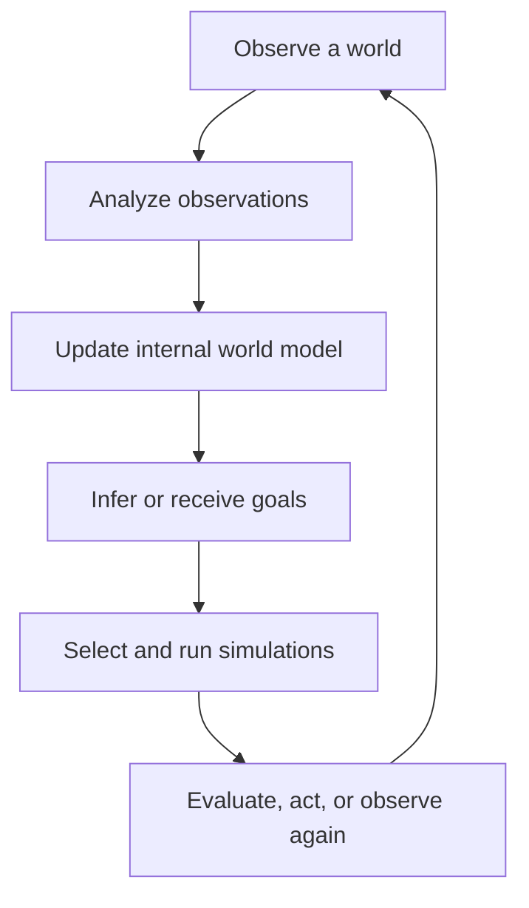

# MeTTaSymbolicLearnerWorkbench

**MeTTaSymbolicLearnerWorkbench** is a workflow desktop for building and running
inspectable experiments that mix symbolic AI, LLMs, visual analysis,
executable representations, and ordinary software modules.

The workbench is organized around **worlds** and **goals**. A world is anything
the system attempts to reconstruct as an internal simulation from observation.
A goal describes, or must itself be learned from, which outcomes matter in
that world. Goals focus attention and determine which hypotheses, experiments,
and simulations are worth running.

The system begins with observation. Processing resources progressively enrich
those observations into typed information: entities, properties, relations,
events, actions, evidence, hypotheses, rules, and executable world models.
Every intermediate result remains available for inspection instead of
disappearing inside a monolithic solver.



The domain-neutral Python API lives in
[`python/worldworkbench`](python/worldworkbench). Its central shared resource
is `WorldAnalysisState`: a compatibility facade over named, typed, versioned
Atoms in logical AtomSpaces.

## The workflow desktop

MeTTaSymbolicLearnerWorkbench combines ideas from several mature analysis environments
with the needs of neurosymbolic experimentation:

| Inspiration | Idea retained in the workbench |
|---|---|
| GATE | Reusable processing resources, visual resources, controllers, and inspection of every intermediate analysis |
| Apache UIMA | A shared typed analysis state that processors enrich rather than reducing everything to untyped files or JSON |
| Galaxy | Saved experiment workflows, reproducible histories, provenance, reruns, and inspectable outputs at every stage |
| MeTTa | Symbolic facts, executable rules, stable identities, learned world models, and composable reasoning modules |
| LLM agent tooling | Selectable models, prompts, reasoning budgets, multimodal calls, transcripts, critiques, and independent validation |

The result is not an NLP-only pipeline, generic job scheduler, or
image-generation graph. A workflow is a reproducible experiment over typed
information. It can combine deterministic code, symbolic reasoning, learned
components, and human interaction without hiding the boundaries among them.

The desktop provides:

- A catalog of workflows, subworkflows, operations, and implementations.
- Typed input and output ports with connection validation.
- Reusable nested workflows with isolated internal slots and explicit port
  bindings.
- Implementations backed by Python, SWI-Prolog, LLM calls, Turtle execution,
  or other registered modules.
- Editable prompts, models, parameters, and reasoning budgets.
- Stepwise execution, pausing for human input, and repeat-from-stage control.
- Inspectors for observations, objects, facts, programs, rendered output,
  hypotheses, rules, comparisons, and evidence.
- Versioned Atoms in AtomSpaces with producer, confidence, and provenance.
- Saved histories that support replay, comparison, restoration, and audit.
- Cycle detection and validation before nested workflows are run.

MeTTa is an intended symbolic implementation route. The currently checked-in
routes include Python, Prolog, LLM-backed operations, and Turtle programs.

## Worlds, observations, and goals

The framework deliberately does not equate a world with a game. A world may be
a visual environment, software interface, robot workspace, scientific
process, sequence of events, or any partially observable system whose
structure and behavior must be learned.

An **observation** is evidence received from that world. It may be an image,
grid, state record, action result, text response, measurement, or a collection
of synchronized views.

A **world model** is the system's current internal account of entities,
relationships, constraints, actions, state transitions, and uncertainties. It
is explicitly revisable: later evidence can support, refine, or contradict
earlier hypotheses without erasing their history.

A **goal** can be supplied by a person, exposed by the environment, or inferred
from demonstrations and outcomes. Goals do not merely score the final answer;
they guide what the system observes, which uncertainties it investigates, and
which possible futures it simulates.

## A workflow for learning by observation

The first complete top-level pattern is an apprenticeship workflow in which
the workbench observes a person interacting with a world:

1. Select a world or scenario.
2. Start it and capture the initial observation.
3. Objectify the observation.
4. Pause while a human chooses and performs an action.
5. Capture and objectify the resulting observation.
6. Compare before, action, and after; then update the emerging explanation.
7. Repeat until the world's behavior and goals become intelligible.

Those seven items are themselves a runnable workflow. Complex stages are not
flattened into opaque operations: they invoke reusable named subworkflows.

For example, **Objectify observation** can expand into:

1. Extract candidate entities and structures.
2. Assign stable identities.
3. Derive properties and relationships.
4. Generate symbolic facts.
5. Generate executable Turtle programs for visual objects.
6. Render those programs.
7. Compare the reconstruction with the source observation.
8. Save validation evidence and unresolved differences.

Turtle is therefore not the purpose of the top-level system. It is one useful
executable representation inside objectification: a visual object can be
described as a program, rendered again, and checked against what was observed.
The same workflow can retain raster, symbolic, programmatic, and feature-based
views of one semantic entity without pretending that those views are the
entity itself.

## Typed analysis state

Processors communicate through AtomSpaces, with `WorldAnalysisState` retained
as the current compatibility API. Each processor queries declared antecedent
Atoms and writes new output Atoms with provenance. Typical views include:

```text
source_observation
observed_state
entity_set
object_identities
properties
relationships
turtle_programs
symbolic_facts
differences
similarities
candidate_rules
world_model
goals
simulation_candidates
predicted_state
evidence
execution_trace
```

Several views may represent the same underlying semantic object. That makes it
possible to ask whether a symbolic description, generated program, rendered
image, and extracted feature set agree—and to preserve the exact evidence when
they do not.

The machine-readable contracts are maintained in:

- [`workbench/docs/DATA_REPRESENTATIONS.md`](workbench/docs/DATA_REPRESENTATIONS.md)
  for the filesystem-backed semantic, representation, and concrete datatype model.
- [`workbench/workspaces/shared_library_system/design/configs/world_workbench_operations.config.metta`](workbench/workspaces/shared_library_system/design/configs/world_workbench_operations.config.metta) for
  operation input/output contracts.
- [`config/llm_workflows.json`](config/llm_workflows.json) for runnable workflows
  and nested subworkflows.
- [`config/workflow_operations.json`](config/workflow_operations.json) for operation
  implementations.
- [`config/llm_providers.json`](config/llm_providers.json) for model providers
  and reusable prompt sections.

## Inspection and provenance

Execution retains intermediate knowledge as named Atoms in identified
AtomSpaces, with type, producer, version, confidence, and provenance. Depending on the workflow, an experiment
may save:

- Source and derived observations.
- Entity identities, properties, and relationships.
- Prolog facts and query results.
- Turtle programs, renders, and source/render comparisons.
- Prompts, responses, critiques, and complete LLM transcripts.
- Candidate rules, predictions, independent grades, and confidence updates.
- Actions, state transitions, simulation branches, and goal evaluations.
- Timing, failures, implementation choices, and configuration snapshots.

This evidence history allows a researcher to inspect an experiment while it is
running, compare alternative implementations, replay earlier stages, and
restore earlier generated artifacts.

## Running the workbench

For the complete local browser demo on Windows, pull `main` and run
[`run_workbench.bat`](run_workbench.bat). It starts the local FastAPI
event backend and live-editing Vite web interface, then opens the workbench at
`http://127.0.0.1:5173/`. No deployment is required; frontend and backend edits
reload from your checkout. See the [local web demo guide](workbench/README.md).

Inside a supported interactive host, press uppercase **`W`** to open the
workflow desktop. Select a workflow and choose **Save and Run Selected**. The
desktop validates typed operation ports, expands nested subworkflows recursively,
rejects cycles and invalid bindings, and executes the experiment through the
active workbench runner.

The workflow and datatype editors can also be used without committing a
particular experimental domain to the core architecture. Application adapters
translate external observations and actions at the boundary while the
workbench continues to operate on general world, goal, simulation, and
evidence types.

## Installation

Python 3.12 or newer is required.

For the workflow desktop, browser UI, notebooks, and tests:

```bash
python -m pip install -e ".[debugger,notebooks,test]"
```

The compatibility requirements file installs the same bundle:

```bash
python -m pip install -r requirements.txt
```

For every optional dependency:

```bash
python -m pip install -e ".[all]"
```

Native Windows users should first follow
[`README_WINDOWS.md`](README_WINDOWS.md), then run:

```bat
scripts\setup_windows.bat
```

## Layered code and resource discovery

The workbench does not assume that code, configuration, and generated evidence
share one global root. Startup records the launch directory and resolves each
resource independently.

### Code/runtime checkout

The Python code root is resolved in this order:

1. `WORLD_WORKBENCH_HOME`, when explicitly set to a valid checkout.
2. The nearest valid project root found while walking upward from the launch
   directory.
3. The project root inferred from the running script or code location.

An invalid explicit `WORLD_WORKBENCH_HOME` is an error because it claims to
select the code checkout.

### Model and prompt configuration

The selected provider configuration is resolved independently:

1. `WORLD_WORKBENCH_LLM_CONFIG`.
2. `WORLD_WORKBENCH_CONFIG_ROOT/llm_providers.json`.
3. The nearest `config/llm_providers.json` found while walking upward from the
   launch directory.
4. The selected workbench/runtime home's configuration, when present.
5. The configuration beside the running code checkout.

This allows an experiment workspace to supply its own provider list and prompt
sections while running code from another checkout.

### Evidence output

The writable experiment-history root is resolved independently:

1. `WORLD_WORKBENCH_RUN_ROOT`.
2. The nearest existing compatible evidence directory found while walking
   upward from the launch directory.
3. The selected workbench/runtime home's evidence directory, when present.
4. The evidence directory beside the running code checkout.
5. A newly created evidence directory beside the selected code root.

The nearest launch-directory `.env` is loaded first, followed by distinct
runtime and script-checkout `.env` files. Loading uses `override=False`, so
shell and IDE variables still win.

## Development and documentation

Run the Python test suite with:

```bash
pytest -q
```

Run the Turtle DSL checks with:

```bash
swipl -q -s prolog/test_turtle_dsl.pl -g run_tests,halt
```

Run the object-memory checks with:

```bash
swipl -q -s prolog/test_object_memory.pl -g run_tests,halt
```

General framework references:

- [World Analysis Workbench architecture](docs/WORLD_ANALYSIS_WORKBENCH.md) —
  AtomSpaces, observations, world models, goals, simulations,
  processing resources, and adapter boundaries.
- [LLM providers, prompt composition, and comparison transcripts](config/README.md)
  — provider selection, reusable prompt blocks, run comparison, and artifact
  restoration.
- [Clickable repository file tree](FILE_TREE.md) — maintained files and their
  responsibilities.

## Flagship application and evaluation: ARC-AGI-3

ARC-AGI-3 is the first complete application adapter and the flagship solver
demonstration built in MeTTaSymbolicLearnerWorkbench. It supplies visual observations,
interventions, episodes, and success conditions, but it does not define the
workbench architecture.

The initial `arc3_human_observation` workflow starts `ls20`, captures and
objectifies its initial state, pauses for a human action, captures and
objectifies the resulting state, analyzes the before/action/after transition,
updates the emerging world model, and repeats. Its complex stages invoke the
reusable capture, objectification, transition-analysis, and world-update
subworkflows declared in
[`config/llm_workflows.json`](config/llm_workflows.json).

From the same desktop, the autonomous solver will reuse perception,
objectification, stable identity, Turtle reconstruction, transition analysis,
world learning, goal reasoning, simulation, action selection, and outcome
evaluation as framework operations and subworkflows. It replaces the human-action
stage with goal-directed candidate simulation while preserving the same
inspectors, AtomSpace bindings, intermediate Atoms, transcripts, and evidence history.

### Start the interactive application

```bash
python scripts/interactive_runner.py ls20
```

On native Windows:

```bat
scripts\interactive_runner.bat ls20
```

Press **`W`**, select the human-observation workflow, and choose **Save and Run
Selected**. Press `g` to cycle configured LLM providers; press `2`, `3`, or `4`
for progressively deeper analysis; press `1` to inspect, restore, or configure
historical model runs; and press `p` for Prolog mode.

Start the browser terminal with:

```bash
python scripts/run_webui.py --game ls20
```

Then open `http://127.0.0.1:8765/`.

Other application demonstrations and protected evaluation commands:

```bash
python scripts/prolog_controlled_runner.py
python scripts/re_play.py
python scripts/my_play.py
python scripts/me_play.py
python scripts/he_play.py
python scripts/play_local.py --game ls20 --max-steps 200
make play-local GAME=ls20 STEPS=200
python scripts/build_notebook.py
make notebook
python scripts/slim_framework.py
swipl -q -g "use_module('prolog/arc3_agent.pl'),halt"
swipl -q -g "use_module('prolog/game_object_learner_api.pl'),halt"
```

Application-specific documentation:

- [Debugger guide](DEBUGGER.md) — controls, action trees, pluggable GPT/Prolog
  analysis, Turtle mock display, web UI, replay, and provider evidence.
- [Local development and Kaggle guide](KAGGLE.md) — setup, local play, notebook
  generation, submission, accelerators, and troubleshooting.
- [Architecture](SOW_PHASE_ARCHITECTURE.md) — phase boundaries, classes,
  modules, data contracts, per-object Turtle programs, learning, and
  prediction.
- [Active implementation TODO](TODO.md) — current maintenance and upcoming
  semantic-learning work.
- [SOW deliverables](SOW_DELIVERABLES.md) — delivered, partial, and open
  outcomes with evidence links.

Legacy `ARC3_*` environment variables remain compatibility aliases for the
preferred `WORLD_WORKBENCH_*` names. The protected Kaggle entry points remain
intact and must not be renamed or repurposed:

- [`agent/my_agent.py`](agent/my_agent.py)
- [`scripts/play_local.py`](scripts/play_local.py)
- [`scripts/build_notebook.py`](scripts/build_notebook.py)
- [`Makefile`](Makefile)
