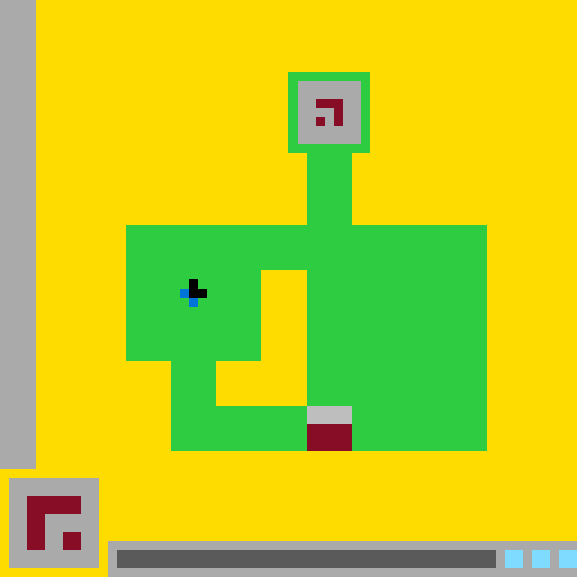

# `ls20` level `1` — Initial state

## Navigation

**Level start**

### Actions

[`DOWN`](DOWN/README.md) · [`LEFT`](LEFT/README.md) · [`UP`](UP/README.md)

---

- **Full game ID:** `ls20`
- **State:** `NOT_FINISHED`
- **Image hash:** `9c879087889c0ade`
- **Incoming action:** `initial`

## Image



## Files

- [image.png](image.png)
- [state.json](state.json)
- [object_registry.pl](object_registry.pl) — shared level registry (25 canonical identities)
- [objects.pl](objects.pl)
- [rules.pl](rules.pl)
- [turtle_from_image.pl](turtle_from_image.pl)

## Embedded files

<details>
<summary><code>state.json</code></summary>

````json
{
  "state": "NOT_FINISHED",
  "level": "1",
  "level_source": "default",
  "next_level_expected": null,
  "observation": {
    "game_id": "ls20-9607627b",
    "state": "NOT_FINISHED",
    "levels_completed": 0,
    "win_levels": 7,
    "action_input": {
      "id": "RESET",
      "data": {},
      "reasoning": null
    },
    "guid": "19932de0-785e-4ecb-9e62-22098df36105",
    "full_reset": true,
    "available_actions": [
      1,
      2,
      3,
      4
    ]
  },
  "step_count": 0,
  "game_id": "ls20",
  "game_directory": "ls20",
  "image_hash": "9c879087889c0ade",
  "incoming_action": null,
  "action_directory": null,
  "action_data": {},
  "parent_node": null,
  "action_path": []
}
````

[Open `state.json`](state.json)

</details>

<details>
<summary><code>object_registry.pl</code></summary>

````prolog
% Canonical friendly object identities for this entire ARC3 level.
% Names are stable across every action-tree branch.

object_identity(black_player_head, player_component, 'black upper portion of the player marker').
object_identity(blue_black_player, player, 'small blue and black player marker').
object_identity(blue_player_tail, player_component, 'blue lower-left portion of the player marker').
object_identity(bottom_center_gate, compound_block, 'two-color gate embedded in the bottom of the green structure').
object_identity(bottom_dark_status_bar, bar, 'dark horizontal bar inside the bottom status panel').
object_identity(bottom_green_status_bar, bar, 'green filled segment at the left of the bottom status panel').
object_identity(bottom_status_panel, interface_bar, 'long gray status panel along the bottom edge').
object_identity(gray_gate_cap, rectangle, 'gray upper cap of the bottom-center gate').
object_identity(gray_upper_chamber_interior, chamber, 'gray interior of the upper chamber').
object_identity(green_chamber_stem, vertical_bar, 'green vertical stem connecting the upper chamber to the main platform').
object_identity(green_main_platform, platform, 'broad central green platform').
object_identity(green_maze_structure, compound_structure, 'large green maze-like structure').
object_identity(green_upper_chamber_frame, enclosure, 'green frame around the upper chamber').
object_identity(left_cyan_status_cell, indicator, 'left cyan status cell').
object_identity(left_gray_border, border, 'left vertical gray boundary').
object_identity(lower_left_control_panel, panel, 'gray control panel at the lower left').
object_identity(lower_left_red_hook_glyph, glyph, 'large dark red hooked symbol on the lower-left panel').
object_identity(lower_left_red_square, glyph_component, 'small detached dark red square on the lower-left panel').
object_identity(middle_cyan_status_cell, indicator, 'middle cyan status cell').
object_identity(red_gate_base, rectangle, 'dark red lower block of the bottom-center gate').
object_identity(right_cyan_status_cell, indicator, 'right cyan status cell at the image edge').
object_identity(upper_red_hook_glyph, glyph, 'dark red hooked symbol in the upper chamber').
object_identity(upper_red_square, glyph_component, 'small detached dark red square in the upper chamber').
object_identity(yellow_inner_cavity, hole, 'yellow stepped cavity enclosed within the green structure').
object_identity(yellow_playfield, background, 'yellow playfield background').
````

[Open `object_registry.pl`](object_registry.pl)

</details>

<details>
<summary><code>objects.pl</code></summary>

````prolog
% Canonical identities are loaded from the level registry.
:- ensure_loaded('object_registry.pl').

% State-specific facts for this action-tree node.
object(yellow_playfield,background,current).
color(yellow_playfield,yellow).
bbox(yellow_playfield,0,0,64,64).
area(yellow_playfield,2509).
cell_runs(yellow_playfield,[rows(0,7,4,63),rows(8,16,4,31),rows(8,16,41,63),rows(17,24,4,33),rows(17,24,39,63),rows(25,29,4,13),rows(25,29,54,63),rows(30,39,4,13),rows(30,39,54,63),rows(40,44,4,18),rows(40,44,54,63),rows(45,49,4,18),rows(45,49,54,63),rows(50,51,4,63),rows(52,52,0,63),rows(53,59,0,0),rows(53,59,11,63),rows(60,62,0,0),rows(60,62,11,11),rows(63,63,0,11)]).
shape(yellow_playfield,irregular_background).
role(yellow_playfield,playfield_background).
confidence(yellow_playfield,1.0).

object(left_gray_border,border,current).
color(left_gray_border,gray).
bbox(left_gray_border,0,0,4,52).
size(left_gray_border,4,52).
area(left_gray_border,208).
cell_runs(left_gray_border,[rows(0,51,0,3)]).
shape(left_gray_border,solid_rectangle).
orientation(left_gray_border,vertical).
role(left_gray_border,boundary).
touches(left_gray_border,yellow_playfield).
confidence(left_gray_border,1.0).

object(green_maze_structure,compound_structure,current).
color(green_maze_structure,green).
bbox(green_maze_structure,14,8,40,42).
area(green_maze_structure,892).
cell_runs(green_maze_structure,[rows(8,8,32,40),rows(9,15,32,32),rows(9,15,40,40),rows(16,16,32,40),rows(17,24,34,38),rows(25,29,14,53),rows(30,30,14,28),rows(30,30,34,53),rows(31,31,14,20),rows(31,31,22,28),rows(31,31,34,53),rows(32,32,14,19),rows(32,32,23,28),rows(32,32,34,53),rows(33,33,14,20),rows(33,33,22,28),rows(33,33,34,53),rows(34,39,14,28),rows(34,39,34,53),rows(40,44,19,23),rows(40,44,34,53),rows(45,49,19,33),rows(45,49,39,53)]).
shape(green_maze_structure,connected_maze_structure).
contains(green_maze_structure,gray_upper_chamber_interior).
contains(green_maze_structure,yellow_inner_cavity).
contains(green_maze_structure,bottom_center_gate).
role(green_maze_structure,main_play_structure).
confidence(green_maze_structure,1.0).

object(green_upper_chamber_frame,enclosure,current).
color(green_upper_chamber_frame,green).
bbox(green_upper_chamber_frame,32,8,9,9).
size(green_upper_chamber_frame,9,9).
area(green_upper_chamber_frame,32).
cell_runs(green_upper_chamber_frame,[rows(8,8,32,40),rows(9,15,32,32),rows(9,15,40,40),rows(16,16,32,40)]).
shape(green_upper_chamber_frame,rectangular_frame).
symmetry(green_upper_chamber_frame,vertical).
component_of(green_upper_chamber_frame,green_maze_structure).
contains(green_upper_chamber_frame,gray_upper_chamber_interior).
contains(green_upper_chamber_frame,upper_red_hook_glyph).
contains(green_upper_chamber_frame,upper_red_square).
confidence(green_upper_chamber_frame,1.0).

object(gray_upper_chamber_interior,chamber,current).
color(gray_upper_chamber_interior,gray).
bbox(gray_upper_chamber_interior,33,9,7,7).
size(gray_upper_chamber_interior,7,7).
area(gray_upper_chamber_interior,43).
cell_runs(gray_upper_chamber_interior,[rows(9,10,33,39),rows(11,11,33,34),rows(11,11,38,39),rows(12,12,33,36),rows(12,12,38,39),rows(13,13,33,34),rows(13,13,36,36),rows(13,13,38,39),rows(14,15,33,39)]).
shape(gray_upper_chamber_interior,rectangular_interior_with_glyph_occlusions).
inside(gray_upper_chamber_interior,green_upper_chamber_frame).
confidence(gray_upper_chamber_interior,1.0).

object(upper_red_hook_glyph,glyph,current).
color(upper_red_hook_glyph,dark_red).
bbox(upper_red_hook_glyph,35,11,3,3).
size(upper_red_hook_glyph,3,3).
area(upper_red_hook_glyph,5).
cell_runs(upper_red_hook_glyph,[rows(11,11,35,37),rows(12,13,37,37)]).
shape(upper_red_hook_glyph,hook).
inside(upper_red_hook_glyph,green_upper_chamber_frame).
component_of(upper_red_hook_glyph,gray_upper_chamber_interior).
confidence(upper_red_hook_glyph,1.0).

object(upper_red_square,glyph_component,current).
color(upper_red_square,dark_red).
bbox(upper_red_square,35,13,1,1).
size(upper_red_square,1,1).
area(upper_red_square,1).
occupied_cells(upper_red_square,[cell(35,13)]).
shape(upper_red_square,single_cell_square).
inside(upper_red_square,green_upper_chamber_frame).
aligned_with(upper_red_square,upper_red_hook_glyph,left_edge).
confidence(upper_red_square,1.0).

object(green_chamber_stem,vertical_bar,current).
color(green_chamber_stem,green).
bbox(green_chamber_stem,34,17,5,8).
size(green_chamber_stem,5,8).
area(green_chamber_stem,40).
cell_runs(green_chamber_stem,[rows(17,24,34,38)]).
shape(green_chamber_stem,solid_rectangle).
orientation(green_chamber_stem,vertical).
component_of(green_chamber_stem,green_maze_structure).
touches(green_chamber_stem,green_upper_chamber_frame).
touches(green_chamber_stem,green_main_platform).
confidence(green_chamber_stem,1.0).

object(green_main_platform,platform,current).
color(green_main_platform,green).
bbox(green_main_platform,14,25,40,25).
size(green_main_platform,40,25).
area(green_main_platform,820).
cell_runs(green_main_platform,[rows(25,29,14,53),rows(30,30,14,28),rows(30,30,34,53),rows(31,31,14,20),rows(31,31,22,28),rows(31,31,34,53),rows(32,32,14,19),rows(32,32,23,28),rows(32,32,34,53),rows(33,33,14,20),rows(33,33,22,28),rows(33,33,34,53),rows(34,39,14,28),rows(34,39,34,53),rows(40,44,19,23),rows(40,44,34,53),rows(45,49,19,33),rows(45,49,39,53)]).
shape(green_main_platform,stepped_platform_with_enclosed_cavity).
component_of(green_main_platform,green_maze_structure).
contains(green_main_platform,yellow_inner_cavity).
contains(green_main_platform,bottom_center_gate).
confidence(green_main_platform,1.0).

object(yellow_inner_cavity,hole,current).
color(yellow_inner_cavity,yellow).
bbox(yellow_inner_cavity,24,30,10,15).
size(yellow_inner_cavity,10,15).
area(yellow_inner_cavity,100).
cell_runs(yellow_inner_cavity,[rows(30,39,29,33),rows(40,44,24,33)]).
shape(yellow_inner_cavity,stepped_cavity).
inside(yellow_inner_cavity,green_main_platform).
inside(yellow_inner_cavity,green_maze_structure).
adjacent(yellow_inner_cavity,green_main_platform).
role(yellow_inner_cavity,enclosed_hole).
confidence(yellow_inner_cavity,1.0).

object(blue_black_player,player,current).
colors(blue_black_player,[black,blue]).
bbox(blue_black_player,20,31,3,3).
size(blue_black_player,3,3).
area(blue_black_player,5).
occupied_cells(blue_black_player,[cell(21,31),cell(20,32),cell(21,32),cell(22,32),cell(21,33)]).
shape(blue_black_player,asymmetric_cross_marker).
inside(blue_black_player,green_main_platform).
role(blue_black_player,player_marker).
confidence(blue_black_player,1.0).

object(black_player_head,player_component,current).
color(black_player_head,black).
bbox(black_player_head,21,31,2,2).
size(black_player_head,2,2).
area(black_player_head,3).
occupied_cells(black_player_head,[cell(21,31),cell(21,32),cell(22,32)]).
shape(black_player_head,right_facing_corner).
component_of(black_player_head,blue_black_player).
confidence(black_player_head,1.0).

object(blue_player_tail,player_component,current).
color(blue_player_tail,blue).
bbox(blue_player_tail,20,32,2,2).
size(blue_player_tail,2,2).
area(blue_player_tail,2).
occupied_cells(blue_player_tail,[cell(20,32),cell(21,33)]).
shape(blue_player_tail,diagonal_pair).
component_of(blue_player_tail,blue_black_player).
confidence(blue_player_tail,1.0).

object(bottom_center_gate,compound_block,current).
colors(bottom_center_gate,[gray,dark_red]).
bbox(bottom_center_gate,34,45,5,5).
size(bottom_center_gate,5,5).
area(bottom_center_gate,25).
cell_runs(bottom_center_gate,[rows(45,49,34,38)]).
shape(bottom_center_gate,two_color_rectangle).
inside(bottom_center_gate,green_main_platform).
component_of(bottom_center_gate,green_maze_structure).
contains(bottom_center_gate,gray_gate_cap).
contains(bottom_center_gate,red_gate_base).
role(bottom_center_gate,embedded_gate).
confidence(bottom_center_gate,1.0).

object(gray_gate_cap,rectangle,current).
color(gray_gate_cap,gray).
bbox(gray_gate_cap,34,45,5,2).
size(gray_gate_cap,5,2).
area(gray_gate_cap,10).
cell_runs(gray_gate_cap,[rows(45,46,34,38)]).
shape(gray_gate_cap,solid_rectangle).
orientation(gray_gate_cap,horizontal).
component_of(gray_gate_cap,bottom_center_gate).
touches(gray_gate_cap,red_gate_base).
confidence(gray_gate_cap,1.0).

object(red_gate_base,rectangle,current).
color(red_gate_base,dark_red).
bbox(red_gate_base,34,47,5,3).
size(red_gate_base,5,3).
area(red_gate_base,15).
cell_runs(red_gate_base,[rows(47,49,34,38)]).
shape(red_gate_base,solid_rectangle).
orientation(red_gate_base,horizontal).
component_of(red_gate_base,bottom_center_gate).
touches(red_gate_base,gray_gate_cap).
confidence(red_gate_base,1.0).

object(lower_left_control_panel,panel,current).
colors(lower_left_control_panel,[gray,dark_red]).
bbox(lower_left_control_panel,1,53,10,10).
size(lower_left_control_panel,10,10).
area(lower_left_control_panel,100).
cell_runs(lower_left_control_panel,[rows(53,62,1,10)]).
shape(lower_left_control_panel,square_panel).
contains(lower_left_control_panel,lower_left_red_hook_glyph).
contains(lower_left_control_panel,lower_left_red_square).
role(lower_left_control_panel,control_panel).
confidence(lower_left_control_panel,1.0).

object(lower_left_red_hook_glyph,glyph,current).
color(lower_left_red_hook_glyph,dark_red).
bbox(lower_left_red_hook_glyph,3,55,6,6).
size(lower_left_red_hook_glyph,6,6).
area(lower_left_red_hook_glyph,20).
cell_runs(lower_left_red_hook_glyph,[rows(55,56,3,8),rows(57,60,3,4)]).
shape(lower_left_red_hook_glyph,thick_hook).
inside(lower_left_red_hook_glyph,lower_left_control_panel).
confidence(lower_left_red_hook_glyph,1.0).

object(lower_left_red_square,glyph_component,current).
color(lower_left_red_square,dark_red).
bbox(lower_left_red_square,7,59,2,2).
size(lower_left_red_square,2,2).
area(lower_left_red_square,4).
cell_runs(lower_left_red_square,[rows(59,60,7,8)]).
shape(lower_left_red_square,solid_square).
inside(lower_left_red_square,lower_left_control_panel).
aligned_with(lower_left_red_square,lower_left_red_hook_glyph,right_edge).
confidence(lower_left_red_square,1.0).

object(bottom_status_panel,interface_bar,current).
colors(bottom_status_panel,[gray,dark_gray,cyan]).
bbox(bottom_status_panel,12,60,52,4).
size(bottom_status_panel,52,4).
area(bottom_status_panel,208).
cell_runs(bottom_status_panel,[rows(60,63,12,63)]).
shape(bottom_status_panel,horizontal_status_panel).
orientation(bottom_status_panel,horizontal).
contains(bottom_status_panel,bottom_dark_status_bar).
contains(bottom_status_panel,left_cyan_status_cell).
contains(bottom_status_panel,middle_cyan_status_cell).
contains(bottom_status_panel,right_cyan_status_cell).
role(bottom_status_panel,status_display).
confidence(bottom_status_panel,1.0).

object(bottom_dark_status_bar,bar,current).
color(bottom_dark_status_bar,dark_gray).
bbox(bottom_dark_status_bar,13,61,42,2).
size(bottom_dark_status_bar,42,2).
area(bottom_dark_status_bar,84).
cell_runs(bottom_dark_status_bar,[rows(61,62,13,54)]).
shape(bottom_dark_status_bar,solid_rectangle).
orientation(bottom_dark_status_bar,horizontal).
component_of(bottom_dark_status_bar,bottom_status_panel).
confidence(bottom_dark_status_bar,1.0).

object(left_cyan_status_cell,indicator,current).
color(left_cyan_status_cell,cyan).
bbox(left_cyan_status_cell,56,61,2,2).
size(left_cyan_status_cell,2,2).
area(left_cyan_status_cell,4).
cell_runs(left_cyan_status_cell,[rows(61,62,56,57)]).
shape(left_cyan_status_cell,solid_square).
component_of(left_cyan_status_cell,bottom_status_panel).
confidence(left_cyan_status_cell,1.0).

object(middle_cyan_status_cell,indicator,current).
color(middle_cyan_status_cell,cyan).
bbox(middle_cyan_status_cell,59,61,2,2).
size(middle_cyan_status_cell,2,2).
area(middle_cyan_status_cell,4).
cell_runs(middle_cyan_status_cell,[rows(61,62,59,60)]).
shape(middle_cyan_status_cell,solid_square).
component_of(middle_cyan_status_cell,bottom_status_panel).
aligned_with(middle_cyan_status_cell,left_cyan_status_cell,horizontal_centerline).
confidence(middle_cyan_status_cell,1.0).

object(right_cyan_status_cell,indicator,current).
color(right_cyan_status_cell,cyan).
bbox(right_cyan_status_cell,62,61,2,2).
size(right_cyan_status_cell,2,2).
area(right_cyan_status_cell,4).
cell_runs(right_cyan_status_cell,[rows(61,62,62,63)]).
shape(right_cyan_status_cell,solid_square).
component_of(right_cyan_status_cell,bottom_status_panel).
aligned_with(right_cyan_status_cell,middle_cyan_status_cell,horizontal_centerline).
touches(right_cyan_status_cell,yellow_playfield).
confidence(right_cyan_status_cell,1.0).
````

[Open `objects.pl`](objects.pl)

</details>

<details>
<summary><code>rules.pl</code></summary>

*Empty file.*

[Open `rules.pl`](rules.pl)

</details>

<details>
<summary><code>turtle_from_image.pl</code></summary>

````prolog
turtle_program(current_grid,[
penup,setcolor(yellow),pen_width(4),set_pos(0,0),pendown,fwd(63),
penup,set_pos(0,4),pendown,fwd(63),
penup,set_pos(0,8),pendown,fwd(63),
penup,set_pos(0,12),pendown,fwd(63),
penup,set_pos(0,16),pendown,fwd(63),
penup,set_pos(0,20),pendown,fwd(63),
penup,set_pos(0,24),pendown,fwd(63),
penup,set_pos(0,28),pendown,fwd(63),
penup,set_pos(0,32),pendown,fwd(63),
penup,set_pos(0,36),pendown,fwd(63),
penup,set_pos(0,40),pendown,fwd(63),
penup,set_pos(0,44),pendown,fwd(63),
penup,set_pos(0,48),pendown,fwd(63),
penup,set_pos(0,52),pendown,fwd(63),
penup,set_pos(0,56),pendown,fwd(63),
penup,set_pos(0,60),pendown,fwd(63),
penup,setcolor(gray),pen_width(4),set_pos(0,0),rot(90),pendown,fwd(51),rot(-90),
penup,setcolor(green),pen_width(1),set_pos(32,8),pendown,fwd(8),rot(90),fwd(8),rot(90),fwd(8),rot(90),fwd(8),rot(90),
penup,setcolor(gray),pen_width(4),set_pos(33,9),pendown,fwd(6),
penup,pen_width(3),set_pos(33,13),pendown,fwd(6),
penup,setcolor(dark_red),pen_width(1),set_pos(35,11),pendown,fwd(2),rot(90),fwd(2),rot(-90),
penup,set_pos(35,13),pendown,set_cell,
penup,setcolor(green),pen_width(4),set_pos(34,17),rot(90),pendown,fwd(7),rot(-90),
penup,pen_width(1),set_pos(38,17),rot(90),pendown,fwd(7),rot(-90),
penup,pen_width(4),set_pos(14,25),pendown,fwd(39),
penup,pen_width(1),set_pos(14,29),pendown,fwd(39),
penup,pen_width(4),set_pos(14,30),pendown,fwd(14),
penup,set_pos(34,30),pendown,fwd(19),
penup,set_pos(14,34),pendown,fwd(14),
penup,set_pos(34,34),pendown,fwd(19),
penup,pen_width(2),set_pos(14,38),pendown,fwd(14),
penup,set_pos(34,38),pendown,fwd(19),
penup,pen_width(4),set_pos(19,40),pendown,fwd(4),
penup,set_pos(34,40),pendown,fwd(19),
penup,pen_width(1),set_pos(19,44),pendown,fwd(4),
penup,set_pos(34,44),pendown,fwd(19),
penup,pen_width(4),set_pos(19,45),pendown,fwd(34),
penup,pen_width(1),set_pos(19,49),pendown,fwd(34),
penup,setcolor(black),pen_width(1),set_pos(21,31),rot(90),pendown,fwd(1),rot(-90),fwd(1),
penup,setcolor(blue),set_pos(20,32),pendown,set_cell,
penup,set_pos(21,33),pendown,set_cell,
penup,setcolor(gray),pen_width(2),set_pos(34,45),pendown,fwd(4),
penup,setcolor(dark_red),pen_width(3),set_pos(34,47),pendown,fwd(4),
penup,setcolor(gray),pen_width(4),set_pos(1,53),pendown,fwd(9),
penup,set_pos(1,57),pendown,fwd(9),
penup,pen_width(2),set_pos(1,61),pendown,fwd(9),
penup,setcolor(dark_red),pen_width(2),set_pos(3,55),pendown,fwd(5),
penup,set_pos(3,55),rot(90),pendown,fwd(5),rot(-90),
penup,set_pos(7,59),pendown,fwd(1),
penup,setcolor(gray),pen_width(4),set_pos(12,60),pendown,fwd(51),
penup,setcolor(dark_gray),pen_width(2),set_pos(13,61),pendown,fwd(41),
penup,setcolor(cyan),pen_width(2),set_pos(56,61),pendown,fwd(1),
penup,set_pos(59,61),pendown,fwd(1),
penup,set_pos(62,61),pendown,fwd(1),penup
]).
````

[Open `turtle_from_image.pl`](turtle_from_image.pl)

</details>
