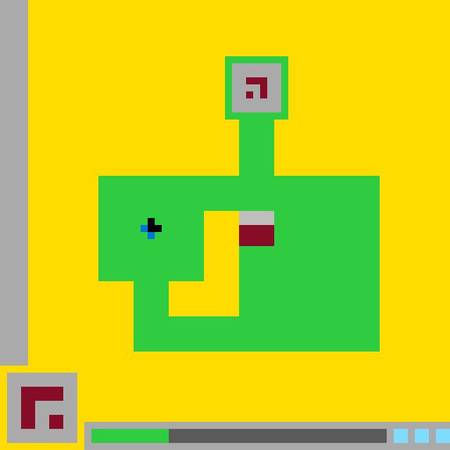

# `ls20` level `1` — UP / UP / DOWN / DOWN / DOWN / DOWN / DOWN / DOWN / UP / UP / UP

## Navigation

[Level start](../../../../../../../../../../../README.md) · [Parent](../README.md)

### Actions

*No child actions recorded yet.*

---

- **Full game ID:** `ls20`
- **State:** `NOT_FINISHED`
- **Image hash:** `07708f80b59ab4f5`
- **Incoming action:** `ACTION1`

## Image



## Files

- [image.png](image.png)
- [state.json](state.json)
- [object_registry.pl](../../../../../../../../../../../object_registry.pl) — shared level registry (25 canonical identities)
- [differences.pl](differences.pl)
- [objects.pl](objects.pl)
- [rules.pl](rules.pl)
- [similarities.pl](similarities.pl)
- [turtle_from_diff.pl](turtle_from_diff.pl)
- [turtle_from_image.pl](turtle_from_image.pl)

## Embedded files

*Canonical identities are shared through [`object_registry.pl`](../../../../../../../../../../../object_registry.pl) and are not repeated in every node.*

<details>
<summary><code>state.json</code></summary>

````json
{
  "state": "NOT_FINISHED",
  "level": "1",
  "level_source": "default",
  "next_level_expected": null,
  "observation": {
    "game_id": "ls20-9607627b",
    "state": "NOT_FINISHED",
    "levels_completed": 0,
    "win_levels": 7,
    "action_input": {
      "id": "ACTION1",
      "data": {},
      "reasoning": null
    },
    "guid": "36f2d7f2-25ea-4100-8983-30d4c064bef5",
    "full_reset": false,
    "available_actions": [
      1,
      2,
      3,
      4
    ]
  },
  "step_count": 10,
  "game_id": "ls20",
  "game_directory": "ls20",
  "image_hash": "07708f80b59ab4f5",
  "incoming_action": "ACTION1",
  "action_directory": "UP",
  "action_data": {},
  "parent_node": "..",
  "action_path": [
    "UP",
    "UP",
    "DOWN",
    "DOWN",
    "DOWN",
    "DOWN",
    "DOWN",
    "DOWN",
    "UP",
    "UP",
    "UP"
  ]
}
````

[Open `state.json`](state.json)

</details>

<details>
<summary><code>differences.pl</code></summary>

````prolog
moved(bottom_center_gate,bbox(34,35,38,39),bbox(34,30,38,34)).
moved(gray_gate_cap,bbox(34,35,38,36),bbox(34,30,38,31)).
moved(red_gate_base,bbox(34,37,38,39),bbox(34,32,38,34)).

restored(cell_runs([run(35,34,38),run(36,34,38),run(37,34,38),run(38,34,38),run(39,34,38)]),[light_gray,dark_red],green).
overwritten(cell_runs([run(30,34,38),run(31,34,38)]),green,light_gray).
overwritten(cell_runs([run(32,34,38),run(33,34,38),run(34,34,38)]),green,dark_red).
reshaped(green_main_platform,area(820),area(820),restored_and_overwritten_gate_footprints).

recolored(cell_runs([run(61,23,23),run(62,23,23)]),dark_gray,green).
resized(bottom_green_status_bar,size(10,2),size(11,2)).
resized(bottom_dark_status_bar,size(32,2),size(31,2)).
changed_bbox(bottom_green_status_bar,bbox(13,61,22,62),bbox(13,61,23,62)).
changed_bbox(bottom_dark_status_bar,bbox(23,61,54,62),bbox(24,61,54,62)).

unchanged(blue_black_player,bbox(20,31,22,33),[cell(21,31),cell(20,32),cell(21,32),cell(22,32),cell(21,33)]).
unchanged(green_upper_chamber_frame,bbox(32,8,40,16),area(32)).
unchanged(gray_upper_chamber_interior,bbox(33,9,39,15),area(43)).
unchanged(yellow_inner_cavity,bbox(24,30,33,44),area(100)).
unchanged(lower_left_control_panel,bbox(1,53,10,62),size(10,10)).
unchanged(bottom_status_panel,bbox(12,60,63,63),size(52,4)).
unchanged(left_cyan_status_cell,bbox(56,61,57,62),area(4)).
unchanged(middle_cyan_status_cell,bbox(59,61,60,62),area(4)).
unchanged(right_cyan_status_cell,bbox(62,61,63,62),area(4)).
````

[Open `differences.pl`](differences.pl)

</details>

<details>
<summary><code>objects.pl</code></summary>

````prolog
% Canonical identities are loaded from the level registry.
:- ensure_loaded('../../../../../../../../../../../object_registry.pl').

% State-specific facts for this action-tree node.
object(yellow_playfield,background,current).
color(yellow_playfield,yellow).
bbox(yellow_playfield,0,0,63,63).
area(yellow_playfield,2509).
shape(yellow_playfield,irregular_background_region).
role(yellow_playfield,background).
confidence(yellow_playfield,1.0).

object(left_gray_border,border,current).
color(left_gray_border,light_gray).
bbox(left_gray_border,0,0,3,51).
size(left_gray_border,4,52).
area(left_gray_border,208).
cell_runs(left_gray_border,[run(0,0,3),run(1,0,3),run(2,0,3),run(3,0,3),run(4,0,3),run(5,0,3),run(6,0,3),run(7,0,3),run(8,0,3),run(9,0,3),run(10,0,3),run(11,0,3),run(12,0,3),run(13,0,3),run(14,0,3),run(15,0,3),run(16,0,3),run(17,0,3),run(18,0,3),run(19,0,3),run(20,0,3),run(21,0,3),run(22,0,3),run(23,0,3),run(24,0,3),run(25,0,3),run(26,0,3),run(27,0,3),run(28,0,3),run(29,0,3),run(30,0,3),run(31,0,3),run(32,0,3),run(33,0,3),run(34,0,3),run(35,0,3),run(36,0,3),run(37,0,3),run(38,0,3),run(39,0,3),run(40,0,3),run(41,0,3),run(42,0,3),run(43,0,3),run(44,0,3),run(45,0,3),run(46,0,3),run(47,0,3),run(48,0,3),run(49,0,3),run(50,0,3),run(51,0,3)]).
shape(left_gray_border,vertical_rectangle).
orientation(left_gray_border,vertical).
role(left_gray_border,boundary).
confidence(left_gray_border,1.0).

object(green_maze_structure,compound_structure,current).
color(green_maze_structure,green).
bbox(green_maze_structure,14,8,53,49).
area(green_maze_structure,892).
shape(green_maze_structure,connected_stepped_structure).
contains(green_maze_structure,green_upper_chamber_frame).
contains(green_maze_structure,green_chamber_stem).
contains(green_maze_structure,green_main_platform).
contains(green_maze_structure,yellow_inner_cavity).
contains(green_maze_structure,bottom_center_gate).
confidence(green_maze_structure,1.0).

object(green_upper_chamber_frame,enclosure,current).
color(green_upper_chamber_frame,green).
bbox(green_upper_chamber_frame,32,8,40,16).
size(green_upper_chamber_frame,9,9).
area(green_upper_chamber_frame,32).
cell_runs(green_upper_chamber_frame,[run(8,32,40),run(9,32,32),run(9,40,40),run(10,32,32),run(10,40,40),run(11,32,32),run(11,40,40),run(12,32,32),run(12,40,40),run(13,32,32),run(13,40,40),run(14,32,32),run(14,40,40),run(15,32,32),run(15,40,40),run(16,32,40)]).
shape(green_upper_chamber_frame,rectangular_frame).
component_of(green_upper_chamber_frame,green_maze_structure).
contains(green_upper_chamber_frame,gray_upper_chamber_interior).
confidence(green_upper_chamber_frame,1.0).

object(gray_upper_chamber_interior,chamber,current).
color(gray_upper_chamber_interior,light_gray).
bbox(gray_upper_chamber_interior,33,9,39,15).
size(gray_upper_chamber_interior,7,7).
area(gray_upper_chamber_interior,43).
cell_runs(gray_upper_chamber_interior,[run(9,33,39),run(10,33,39),run(11,33,34),run(11,38,39),run(12,33,36),run(12,38,39),run(13,33,34),run(13,36,36),run(13,38,39),run(14,33,39),run(15,33,39)]).
shape(gray_upper_chamber_interior,rectangular_chamber_with_glyph).
inside(gray_upper_chamber_interior,green_upper_chamber_frame).
contains(gray_upper_chamber_interior,upper_red_hook_glyph).
contains(gray_upper_chamber_interior,upper_red_square).
confidence(gray_upper_chamber_interior,1.0).

object(upper_red_hook_glyph,glyph,current).
color(upper_red_hook_glyph,dark_red).
bbox(upper_red_hook_glyph,35,11,37,13).
area(upper_red_hook_glyph,5).
occupied_cells(upper_red_hook_glyph,[cell(35,11),cell(36,11),cell(37,11),cell(37,12),cell(37,13)]).
shape(upper_red_hook_glyph,hook).
inside(upper_red_hook_glyph,gray_upper_chamber_interior).
confidence(upper_red_hook_glyph,1.0).

object(upper_red_square,glyph_component,current).
color(upper_red_square,dark_red).
bbox(upper_red_square,35,13,35,13).
size(upper_red_square,1,1).
area(upper_red_square,1).
occupied_cells(upper_red_square,[cell(35,13)]).
shape(upper_red_square,square).
inside(upper_red_square,gray_upper_chamber_interior).
confidence(upper_red_square,1.0).

object(green_chamber_stem,vertical_bar,current).
color(green_chamber_stem,green).
bbox(green_chamber_stem,34,17,38,24).
size(green_chamber_stem,5,8).
area(green_chamber_stem,40).
cell_runs(green_chamber_stem,[run(17,34,38),run(18,34,38),run(19,34,38),run(20,34,38),run(21,34,38),run(22,34,38),run(23,34,38),run(24,34,38)]).
shape(green_chamber_stem,vertical_rectangle).
orientation(green_chamber_stem,vertical).
component_of(green_chamber_stem,green_maze_structure).
touches(green_chamber_stem,green_upper_chamber_frame).
touches(green_chamber_stem,green_main_platform).
confidence(green_chamber_stem,1.0).

object(green_main_platform,platform,current).
color(green_main_platform,green).
bbox(green_main_platform,14,25,53,49).
area(green_main_platform,820).
cell_runs(green_main_platform,[run(25,14,53),run(26,14,53),run(27,14,53),run(28,14,53),run(29,14,53),run(30,14,28),run(30,39,53),run(31,14,20),run(31,22,28),run(31,39,53),run(32,14,19),run(32,23,28),run(32,39,53),run(33,14,20),run(33,22,28),run(33,39,53),run(34,14,28),run(34,39,53),run(35,14,28),run(35,34,53),run(36,14,28),run(36,34,53),run(37,14,28),run(37,34,53),run(38,14,28),run(38,34,53),run(39,14,28),run(39,34,53),run(40,19,23),run(40,34,53),run(41,19,23),run(41,34,53),run(42,19,23),run(42,34,53),run(43,19,23),run(43,34,53),run(44,19,23),run(44,34,53),run(45,19,53),run(46,19,53),run(47,19,53),run(48,19,53),run(49,19,53)]).
shape(green_main_platform,stepped_platform_with_cavity).
component_of(green_main_platform,green_maze_structure).
contains(green_main_platform,yellow_inner_cavity).
contains(green_main_platform,bottom_center_gate).
confidence(green_main_platform,1.0).

object(yellow_inner_cavity,hole,current).
color(yellow_inner_cavity,yellow).
bbox(yellow_inner_cavity,24,30,33,44).
area(yellow_inner_cavity,100).
cell_runs(yellow_inner_cavity,[run(30,29,33),run(31,29,33),run(32,29,33),run(33,29,33),run(34,29,33),run(35,29,33),run(36,29,33),run(37,29,33),run(38,29,33),run(39,29,33),run(40,24,33),run(41,24,33),run(42,24,33),run(43,24,33),run(44,24,33)]).
shape(yellow_inner_cavity,stepped_enclosed_cavity).
inside(yellow_inner_cavity,green_maze_structure).
adjacent(yellow_inner_cavity,bottom_center_gate).
confidence(yellow_inner_cavity,1.0).

object(blue_black_player,player,current).
colors(blue_black_player,[blue,black]).
bbox(blue_black_player,20,31,22,33).
area(blue_black_player,5).
occupied_cells(blue_black_player,[cell(21,31),cell(20,32),cell(21,32),cell(22,32),cell(21,33)]).
shape(blue_black_player,small_asymmetric_marker).
contains(blue_black_player,black_player_head).
contains(blue_black_player,blue_player_tail).
inside(blue_black_player,green_main_platform).
role(blue_black_player,player_marker).
confidence(blue_black_player,1.0).

object(black_player_head,player_component,current).
color(black_player_head,black).
bbox(black_player_head,21,31,22,32).
area(black_player_head,3).
occupied_cells(black_player_head,[cell(21,31),cell(21,32),cell(22,32)]).
shape(black_player_head,corner_triomino).
component_of(black_player_head,blue_black_player).
confidence(black_player_head,1.0).

object(blue_player_tail,player_component,current).
color(blue_player_tail,blue).
bbox(blue_player_tail,20,32,21,33).
area(blue_player_tail,2).
occupied_cells(blue_player_tail,[cell(20,32),cell(21,33)]).
shape(blue_player_tail,diagonal_pair).
component_of(blue_player_tail,blue_black_player).
confidence(blue_player_tail,1.0).

object(bottom_center_gate,compound_block,current).
colors(bottom_center_gate,[light_gray,dark_red]).
bbox(bottom_center_gate,34,30,38,34).
size(bottom_center_gate,5,5).
area(bottom_center_gate,25).
shape(bottom_center_gate,two_color_rectangle).
component_of(bottom_center_gate,green_maze_structure).
contains(bottom_center_gate,gray_gate_cap).
contains(bottom_center_gate,red_gate_base).
adjacent(bottom_center_gate,yellow_inner_cavity).
confidence(bottom_center_gate,1.0).

object(gray_gate_cap,rectangle,current).
color(gray_gate_cap,light_gray).
bbox(gray_gate_cap,34,30,38,31).
size(gray_gate_cap,5,2).
area(gray_gate_cap,10).
cell_runs(gray_gate_cap,[run(30,34,38),run(31,34,38)]).
shape(gray_gate_cap,solid_rectangle).
orientation(gray_gate_cap,horizontal).
component_of(gray_gate_cap,bottom_center_gate).
confidence(gray_gate_cap,1.0).

object(red_gate_base,rectangle,current).
color(red_gate_base,dark_red).
bbox(red_gate_base,34,32,38,34).
size(red_gate_base,5,3).
area(red_gate_base,15).
cell_runs(red_gate_base,[run(32,34,38),run(33,34,38),run(34,34,38)]).
shape(red_gate_base,solid_rectangle).
orientation(red_gate_base,horizontal).
component_of(red_gate_base,bottom_center_gate).
confidence(red_gate_base,1.0).

object(lower_left_control_panel,panel,current).
colors(lower_left_control_panel,[light_gray,dark_red]).
bbox(lower_left_control_panel,1,53,10,62).
size(lower_left_control_panel,10,10).
area(lower_left_control_panel,100).
shape(lower_left_control_panel,square_control_panel).
contains(lower_left_control_panel,lower_left_red_hook_glyph).
contains(lower_left_control_panel,lower_left_red_square).
confidence(lower_left_control_panel,1.0).

object(lower_left_red_hook_glyph,glyph,current).
color(lower_left_red_hook_glyph,dark_red).
bbox(lower_left_red_hook_glyph,3,55,8,60).
area(lower_left_red_hook_glyph,20).
cell_runs(lower_left_red_hook_glyph,[run(55,3,8),run(56,3,8),run(57,3,4),run(58,3,4),run(59,3,4),run(60,3,4)]).
shape(lower_left_red_hook_glyph,thick_hook).
inside(lower_left_red_hook_glyph,lower_left_control_panel).
confidence(lower_left_red_hook_glyph,1.0).

object(lower_left_red_square,glyph_component,current).
color(lower_left_red_square,dark_red).
bbox(lower_left_red_square,7,59,8,60).
size(lower_left_red_square,2,2).
area(lower_left_red_square,4).
cell_runs(lower_left_red_square,[run(59,7,8),run(60,7,8)]).
shape(lower_left_red_square,square).
inside(lower_left_red_square,lower_left_control_panel).
confidence(lower_left_red_square,1.0).

object(bottom_status_panel,interface_bar,current).
colors(bottom_status_panel,[light_gray,green,dark_gray,cyan]).
bbox(bottom_status_panel,12,60,63,63).
size(bottom_status_panel,52,4).
area(bottom_status_panel,208).
shape(bottom_status_panel,compound_horizontal_status_panel).
orientation(bottom_status_panel,horizontal).
contains(bottom_status_panel,bottom_green_status_bar).
contains(bottom_status_panel,bottom_dark_status_bar).
contains(bottom_status_panel,left_cyan_status_cell).
contains(bottom_status_panel,middle_cyan_status_cell).
contains(bottom_status_panel,right_cyan_status_cell).
role(bottom_status_panel,status_display).
confidence(bottom_status_panel,1.0).

object(bottom_green_status_bar,bar,current).
color(bottom_green_status_bar,green).
bbox(bottom_green_status_bar,13,61,23,62).
size(bottom_green_status_bar,11,2).
area(bottom_green_status_bar,22).
cell_runs(bottom_green_status_bar,[run(61,13,23),run(62,13,23)]).
shape(bottom_green_status_bar,solid_horizontal_bar).
orientation(bottom_green_status_bar,horizontal).
component_of(bottom_green_status_bar,bottom_status_panel).
role(bottom_green_status_bar,filled_status_segment).
confidence(bottom_green_status_bar,1.0).

object(bottom_dark_status_bar,bar,current).
color(bottom_dark_status_bar,dark_gray).
bbox(bottom_dark_status_bar,24,61,54,62).
size(bottom_dark_status_bar,31,2).
area(bottom_dark_status_bar,62).
cell_runs(bottom_dark_status_bar,[run(61,24,54),run(62,24,54)]).
shape(bottom_dark_status_bar,solid_horizontal_bar).
orientation(bottom_dark_status_bar,horizontal).
component_of(bottom_dark_status_bar,bottom_status_panel).
role(bottom_dark_status_bar,unfilled_status_segment).
adjacent(bottom_dark_status_bar,bottom_green_status_bar).
confidence(bottom_dark_status_bar,1.0).

object(left_cyan_status_cell,indicator,current).
color(left_cyan_status_cell,cyan).
bbox(left_cyan_status_cell,56,61,57,62).
size(left_cyan_status_cell,2,2).
area(left_cyan_status_cell,4).
cell_runs(left_cyan_status_cell,[run(61,56,57),run(62,56,57)]).
shape(left_cyan_status_cell,square).
component_of(left_cyan_status_cell,bottom_status_panel).
role(left_cyan_status_cell,status_indicator).
confidence(left_cyan_status_cell,1.0).

object(middle_cyan_status_cell,indicator,current).
color(middle_cyan_status_cell,cyan).
bbox(middle_cyan_status_cell,59,61,60,62).
size(middle_cyan_status_cell,2,2).
area(middle_cyan_status_cell,4).
cell_runs(middle_cyan_status_cell,[run(61,59,60),run(62,59,60)]).
shape(middle_cyan_status_cell,square).
component_of(middle_cyan_status_cell,bottom_status_panel).
role(middle_cyan_status_cell,status_indicator).
confidence(middle_cyan_status_cell,1.0).

object(right_cyan_status_cell,indicator,current).
color(right_cyan_status_cell,cyan).
bbox(right_cyan_status_cell,62,61,63,62).
size(right_cyan_status_cell,2,2).
area(right_cyan_status_cell,4).
cell_runs(right_cyan_status_cell,[run(61,62,63),run(62,62,63)]).
shape(right_cyan_status_cell,square).
component_of(right_cyan_status_cell,bottom_status_panel).
role(right_cyan_status_cell,status_indicator).
confidence(right_cyan_status_cell,1.0).
````

[Open `objects.pl`](objects.pl)

</details>

<details>
<summary><code>rules.pl</code></summary>

````prolog
hypothetical_rule(action1_gate_step,action(action1),effect(translate(bottom_center_gate,0,-5))).
hypothetical_rule(action1_status_advance,action(action1),effect(advance_status_partition,1)).
hypothetical_rule(action1_combined_progress,action(action1),effect([translate(bottom_center_gate,0,-5),recolor(column(23,61,62),dark_gray,green)])).

evidence(action1_gate_step,parent_gate_geometry,[bbox(34,35,38,39),cap_bbox(34,35,38,36),base_bbox(34,37,38,39)]).
evidence(action1_gate_step,current_gate_geometry,[bbox(34,30,38,34),cap_bbox(34,30,38,31),base_bbox(34,32,38,34)]).
evidence(action1_gate_step,exact_translation,[delta(0,-5),preserved_size(5,5),preserved_color_layout]).
evidence(action1_status_advance,status_cell_change,[cell(23,61,dark_gray,green),cell(23,62,dark_gray,green)]).
evidence(action1_status_advance,status_bar_dimensions,[green_width(10,11),dark_width(32,31)]).
evidence(action1_combined_progress,synchronized_observation,[gate_translation(0,-5),status_advance_columns(1)]).

supported_by(action1_gate_step,parent_gate_geometry).
supported_by(action1_gate_step,current_gate_geometry).
supported_by(action1_gate_step,exact_translation).
supported_by(action1_status_advance,status_cell_change).
supported_by(action1_status_advance,status_bar_dimensions).
supported_by(action1_combined_progress,synchronized_observation).

confidence(action1_gate_step,0.72).
confidence(action1_status_advance,0.72).
confidence(action1_combined_progress,0.62).
````

[Open `rules.pl`](rules.pl)

</details>

<details>
<summary><code>similarities.pl</code></summary>

````prolog
correspondence(yellow_playfield,yellow_playfield,1.0).
matched_properties(yellow_playfield,yellow_playfield,[color,background_role,outer_connectivity]).
changed_properties(yellow_playfield,yellow_playfield,[]).

correspondence(left_gray_border,left_gray_border,1.0).
matched_properties(left_gray_border,left_gray_border,[color,bbox,size,area,shape]).
changed_properties(left_gray_border,left_gray_border,[]).

correspondence(green_maze_structure,green_maze_structure,0.99).
matched_properties(green_maze_structure,green_maze_structure,[color,bbox,connectivity,components]).
changed_properties(green_maze_structure,green_maze_structure,[gate_occupied_cells]).

correspondence(green_upper_chamber_frame,green_upper_chamber_frame,1.0).
matched_properties(green_upper_chamber_frame,green_upper_chamber_frame,[color,bbox,area,cell_runs]).
changed_properties(green_upper_chamber_frame,green_upper_chamber_frame,[]).

correspondence(gray_upper_chamber_interior,gray_upper_chamber_interior,1.0).
matched_properties(gray_upper_chamber_interior,gray_upper_chamber_interior,[color,bbox,area,cell_runs]).
changed_properties(gray_upper_chamber_interior,gray_upper_chamber_interior,[]).

correspondence(upper_red_hook_glyph,upper_red_hook_glyph,1.0).
matched_properties(upper_red_hook_glyph,upper_red_hook_glyph,[color,bbox,occupied_cells,shape]).
changed_properties(upper_red_hook_glyph,upper_red_hook_glyph,[]).

correspondence(upper_red_square,upper_red_square,1.0).
matched_properties(upper_red_square,upper_red_square,[color,bbox,occupied_cells]).
changed_properties(upper_red_square,upper_red_square,[]).

correspondence(green_chamber_stem,green_chamber_stem,1.0).
matched_properties(green_chamber_stem,green_chamber_stem,[color,bbox,size,area]).
changed_properties(green_chamber_stem,green_chamber_stem,[]).

correspondence(green_main_platform,green_main_platform,0.97).
matched_properties(green_main_platform,green_main_platform,[color,bbox,area,stepped_outline,cavity]).
changed_properties(green_main_platform,green_main_platform,[occupied_cells_at_gate_source_and_destination]).
correspondence_evidence(green_main_platform,green_main_platform,[same_area(820),restored_rows(35,39,34,38),overwritten_rows(30,34,34,38)]).

correspondence(yellow_inner_cavity,yellow_inner_cavity,1.0).
matched_properties(yellow_inner_cavity,yellow_inner_cavity,[color,bbox,area,cell_runs,enclosure]).
changed_properties(yellow_inner_cavity,yellow_inner_cavity,[]).

correspondence(blue_black_player,blue_black_player,1.0).
matched_properties(blue_black_player,blue_black_player,[colors,bbox,occupied_cells,shape]).
changed_properties(blue_black_player,blue_black_player,[]).

correspondence(black_player_head,black_player_head,1.0).
matched_properties(black_player_head,black_player_head,[color,bbox,occupied_cells]).
changed_properties(black_player_head,black_player_head,[]).

correspondence(blue_player_tail,blue_player_tail,1.0).
matched_properties(blue_player_tail,blue_player_tail,[color,bbox,occupied_cells]).
changed_properties(blue_player_tail,blue_player_tail,[]).

correspondence(bottom_center_gate,bottom_center_gate,1.0).
matched_properties(bottom_center_gate,bottom_center_gate,[colors,size,area,shape,internal_layout]).
changed_properties(bottom_center_gate,bottom_center_gate,[bbox,position]).
correspondence_evidence(bottom_center_gate,bottom_center_gate,[translation(0,-5),same_size(5,5),same_cap_size(5,2),same_base_size(5,3)]).

correspondence(gray_gate_cap,gray_gate_cap,1.0).
matched_properties(gray_gate_cap,gray_gate_cap,[color,size,area,shape]).
changed_properties(gray_gate_cap,gray_gate_cap,[bbox,position]).

correspondence(red_gate_base,red_gate_base,1.0).
matched_properties(red_gate_base,red_gate_base,[color,size,area,shape]).
changed_properties(red_gate_base,red_gate_base,[bbox,position]).

correspondence(lower_left_control_panel,lower_left_control_panel,1.0).
matched_properties(lower_left_control_panel,lower_left_control_panel,[colors,bbox,size,glyph_layout]).
changed_properties(lower_left_control_panel,lower_left_control_panel,[]).

correspondence(lower_left_red_hook_glyph,lower_left_red_hook_glyph,1.0).
matched_properties(lower_left_red_hook_glyph,lower_left_red_hook_glyph,[color,bbox,cell_runs,shape]).
changed_properties(lower_left_red_hook_glyph,lower_left_red_hook_glyph,[]).

correspondence(lower_left_red_square,lower_left_red_square,1.0).
matched_properties(lower_left_red_square,lower_left_red_square,[color,bbox,size,cell_runs]).
changed_properties(lower_left_red_square,lower_left_red_square,[]).

correspondence(bottom_status_panel,bottom_status_panel,0.99).
matched_properties(bottom_status_panel,bottom_status_panel,[bbox,size,outer_frame,cyan_indicators]).
changed_properties(bottom_status_panel,bottom_status_panel,[green_dark_partition]).

correspondence(bottom_green_status_bar,bottom_green_status_bar,0.98).
matched_properties(bottom_green_status_bar,bottom_green_status_bar,[color,height,orientation,left_edge]).
changed_properties(bottom_green_status_bar,bottom_green_status_bar,[width,right_edge,area]).
correspondence_evidence(bottom_green_status_bar,bottom_green_status_bar,[width_change(10,11),added_cells([cell(23,61),cell(23,62)])]).

correspondence(bottom_dark_status_bar,bottom_dark_status_bar,0.98).
matched_properties(bottom_dark_status_bar,bottom_dark_status_bar,[color,height,orientation,right_edge]).
changed_properties(bottom_dark_status_bar,bottom_dark_status_bar,[width,left_edge,area]).
correspondence_evidence(bottom_dark_status_bar,bottom_dark_status_bar,[width_change(32,31),removed_cells([cell(23,61),cell(23,62)])]).

correspondence(left_cyan_status_cell,left_cyan_status_cell,1.0).
matched_properties(left_cyan_status_cell,left_cyan_status_cell,[color,bbox,size,area]).
changed_properties(left_cyan_status_cell,left_cyan_status_cell,[]).

correspondence(middle_cyan_status_cell,middle_cyan_status_cell,1.0).
matched_properties(middle_cyan_status_cell,middle_cyan_status_cell,[color,bbox,size,area]).
changed_properties(middle_cyan_status_cell,middle_cyan_status_cell,[]).

correspondence(right_cyan_status_cell,right_cyan_status_cell,1.0).
matched_properties(right_cyan_status_cell,right_cyan_status_cell,[color,bbox,size,area]).
changed_properties(right_cyan_status_cell,right_cyan_status_cell,[]).
````

[Open `similarities.pl`](similarities.pl)

</details>

<details>
<summary><code>turtle_from_diff.pl</code></summary>

````prolog
turtle_program(parent_to_current_patch,[penup,setcolor(green),pen_width(4),set_pos(34,35),pendown,fwd(4),penup,pen_width(1),set_pos(34,39),pendown,fwd(4),penup,setcolor(light_gray),pen_width(2),set_pos(34,30),pendown,fwd(4),penup,setcolor(dark_red),pen_width(3),set_pos(34,32),pendown,fwd(4),penup,setcolor(green),pen_width(1),set_pos(23,61),pendown,rot(90),fwd(1),rot(-90),penup]).
````

[Open `turtle_from_diff.pl`](turtle_from_diff.pl)

</details>

<details>
<summary><code>turtle_from_image.pl</code></summary>

````prolog
turtle_program(current_full_frame,[penup,setcolor(yellow),pen_width(4),set_pos(0,0),pendown,fwd(63),penup,set_pos(0,4),pendown,fwd(63),penup,set_pos(0,8),pendown,fwd(63),penup,set_pos(0,12),pendown,fwd(63),penup,set_pos(0,16),pendown,fwd(63),penup,set_pos(0,20),pendown,fwd(63),penup,set_pos(0,24),pendown,fwd(63),penup,set_pos(0,28),pendown,fwd(63),penup,set_pos(0,32),pendown,fwd(63),penup,set_pos(0,36),pendown,fwd(63),penup,set_pos(0,40),pendown,fwd(63),penup,set_pos(0,44),pendown,fwd(63),penup,set_pos(0,48),pendown,fwd(63),penup,set_pos(0,52),pendown,fwd(63),penup,set_pos(0,56),pendown,fwd(63),penup,set_pos(0,60),pendown,fwd(63),penup,setcolor(light_gray),pen_width(4),set_pos(0,0),pendown,fwd(3),penup,set_pos(0,4),pendown,fwd(3),penup,set_pos(0,8),pendown,fwd(3),penup,set_pos(0,12),pendown,fwd(3),penup,set_pos(0,16),pendown,fwd(3),penup,set_pos(0,20),pendown,fwd(3),penup,set_pos(0,24),pendown,fwd(3),penup,set_pos(0,28),pendown,fwd(3),penup,set_pos(0,32),pendown,fwd(3),penup,set_pos(0,36),pendown,fwd(3),penup,set_pos(0,40),pendown,fwd(3),penup,set_pos(0,44),pendown,fwd(3),penup,set_pos(0,48),pendown,fwd(3),penup,setcolor(green),pen_width(4),set_pos(32,8),pendown,fwd(8),penup,set_pos(32,12),pendown,fwd(8),penup,pen_width(1),set_pos(32,16),pendown,fwd(8),penup,pen_width(4),set_pos(34,17),pendown,fwd(4),penup,set_pos(34,21),pendown,fwd(4),penup,set_pos(14,25),pendown,fwd(39),penup,pen_width(1),set_pos(14,29),pendown,fwd(39),penup,pen_width(4),set_pos(14,30),pendown,fwd(14),penup,set_pos(34,30),pendown,fwd(19),penup,set_pos(14,34),pendown,fwd(14),penup,set_pos(34,34),pendown,fwd(19),penup,pen_width(2),set_pos(14,38),pendown,fwd(14),penup,set_pos(34,38),pendown,fwd(19),penup,pen_width(4),set_pos(19,40),pendown,fwd(4),penup,set_pos(34,40),pendown,fwd(19),penup,pen_width(1),set_pos(19,44),pendown,fwd(4),penup,set_pos(34,44),pendown,fwd(19),penup,pen_width(4),set_pos(19,45),pendown,fwd(34),penup,pen_width(1),set_pos(19,49),pendown,fwd(34),penup,setcolor(light_gray),pen_width(4),set_pos(33,9),pendown,fwd(6),penup,pen_width(3),set_pos(33,13),pendown,fwd(6),penup,setcolor(dark_red),pen_width(1),set_pos(35,11),pendown,fwd(2),rot(90),fwd(2),rot(-90),penup,set_pos(35,13),set_cell,setcolor(blue),set_pos(20,32),set_cell,set_pos(21,33),set_cell,setcolor(black),set_pos(21,31),pendown,rot(90),fwd(1),rot(-90),fwd(1),penup,setcolor(light_gray),pen_width(2),set_pos(34,30),pendown,fwd(4),penup,setcolor(dark_red),pen_width(3),set_pos(34,32),pendown,fwd(4),penup,setcolor(light_gray),pen_width(4),set_pos(1,53),pendown,fwd(9),penup,set_pos(1,57),pendown,fwd(9),penup,pen_width(2),set_pos(1,61),pendown,fwd(9),penup,setcolor(dark_red),pen_width(2),set_pos(3,55),pendown,fwd(5),penup,set_pos(3,55),pendown,rot(90),fwd(5),rot(-90),penup,set_pos(7,59),pendown,fwd(1),penup,setcolor(light_gray),pen_width(4),set_pos(12,60),pendown,fwd(51),penup,setcolor(green),pen_width(2),set_pos(13,61),pendown,fwd(10),penup,setcolor(dark_gray),set_pos(24,61),pendown,fwd(30),penup,setcolor(cyan),set_pos(56,61),pendown,fwd(1),penup,set_pos(59,61),pendown,fwd(1),penup,set_pos(62,61),pendown,fwd(1),penup]).
````

[Open `turtle_from_image.pl`](turtle_from_image.pl)

</details>
