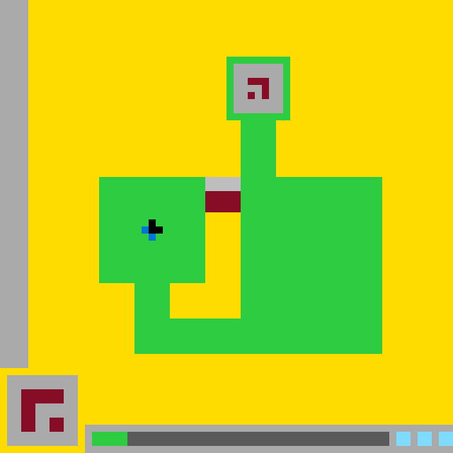

# `ls20` level `1` — UP / UP / UP / UP / LEFT

## Navigation

[Level start](../../../../../README.md) · [Parent](../README.md)

### Actions

[`LEFT`](LEFT/README.md)

---

- **Full game ID:** `ls20`
- **State:** `NOT_FINISHED`
- **Image hash:** `ffb7e32a8f7b5ba0`
- **Incoming action:** `ACTION3`

## Image



## Files

- [image.png](image.png)
- [state.json](state.json)
- [object_registry.pl](../../../../../object_registry.pl) — shared level registry (25 canonical identities)

## Embedded files

*Canonical identities are shared through [`object_registry.pl`](../../../../../object_registry.pl) and are not repeated in every node.*

<details>
<summary><code>state.json</code></summary>

````json
{
  "state": "NOT_FINISHED",
  "level": "1",
  "level_source": "default",
  "next_level_expected": null,
  "observation": {
    "game_id": "ls20-9607627b",
    "state": "NOT_FINISHED",
    "levels_completed": 0,
    "win_levels": 7,
    "action_input": {
      "id": "ACTION3",
      "data": {},
      "reasoning": null
    },
    "guid": "19932de0-785e-4ecb-9e62-22098df36105",
    "full_reset": false,
    "available_actions": [
      1,
      2,
      3,
      4
    ]
  },
  "step_count": 4,
  "game_id": "ls20",
  "game_directory": "ls20",
  "image_hash": "ffb7e32a8f7b5ba0",
  "incoming_action": "ACTION3",
  "action_directory": "LEFT",
  "action_data": {},
  "parent_node": "..",
  "action_path": [
    "UP",
    "UP",
    "UP",
    "UP",
    "LEFT"
  ]
}
````

[Open `state.json`](state.json)

</details>
