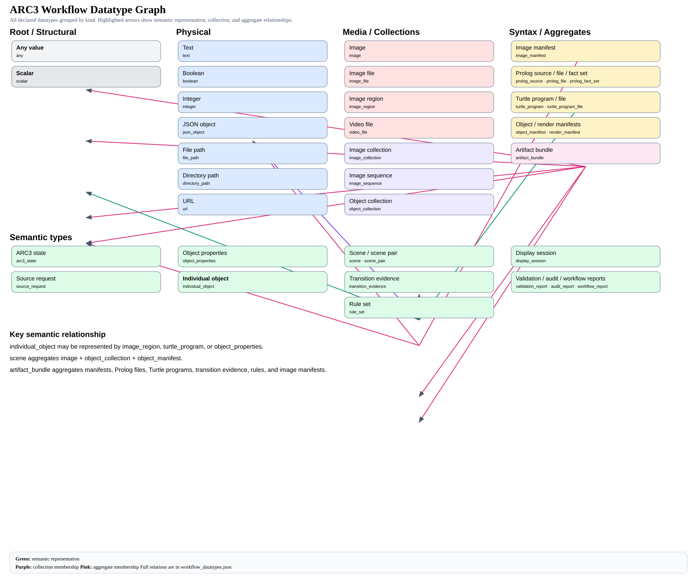

[← Back to top-level README](../README.md) · [LLM and workflow configuration](../config/README.md)

# Symbolic Datatypes in AtomSpace Explained

The symbolic workflow system does not merely pass files or strings from one operation to another. Workflow operations query and update **typed OpenCog AtomSpaces**.

Each AtomSpace contains Atoms. Those Atoms may denote text, an image, a Turtle program, Prolog facts, JSON, a report, or another concrete form. An Atom cannot exist outside an AtomSpace. The representation alone is not enough to explain the information. A text-denoting Atom may describe free-form text, a birthdate, a rule explanation, an object identity, or a validation result. Those Atoms may share the same concrete representation while having very different meanings.

The datatype manifest therefore separates:

- **information meaning** from **information representation**;
- **semantic types** from **physical or syntactic datatypes**;
- **individual values** from **collections and aggregates**;
- **operation contracts** from the implementations that perform them;
- and **workflow routing** from the data events that activate new branches.



The machine-readable form of this graph is stored in [`workflow_datatypes.json`](../config/workflow_datatypes.json). Reusable operation contracts and implementation routes are stored in [`workflow_operations.json`](../config/workflow_operations.json).

---

## 1. Information is the root concept

Every symbolic datatype depicts, carries, or organizes information.

A useful root hierarchy is:

```text
Information
├── Visual Information
├── Textual Information
├── Temporal Information
├── Spatial Information
├── Identity Information
├── Descriptive Information
├── Symbolic Information
├── Program Information
├── Evidence
├── Rule Information
├── Validation Information
├── Provenance Information
└── Aggregate Information
```

A value may belong to several information categories simultaneously.

For example:

```text
"1970-04-12"
```

may be all of the following:

```text
Information
Temporal Information
Personal Information
Birthdate
ISO Date
Text-encoded Value
```

Likewise, an observed object can be simultaneously:

```text
Information
Visual Information
Spatial Information
Identity Information
Individual Object
Semantic Bundle
```

The type system should preserve both the concrete representation and the semantic meaning.

---

## 2. Representation datatype versus semantic information type

### Representation datatype

A representation datatype describes how information is encoded, stored, transported, or interpreted by software.

Examples include:

```text
text
markdown
integer
iso_date
json_object
image_file
image_collection
prolog_file
prolog_fact_set
turtle_program
turtle_program_file
```

It answers:

> In what concrete form is this information available?

### Semantic information type

A semantic type describes what the information means.

Examples include:

```text
description
birthdate
individual_object
scene
transition_evidence
object_identity
candidate_rule
validation_result
provenance_record
```

It answers:

> What kind of information is this value expressing?

Two values may therefore share the same representation datatype but have different semantic types:

```json
{
  "representation_type": "text",
  "semantic_type": "biographical_description",
  "value": "Douglas is a neurologist and computer scientist."
}
```

versus:

```json
{
  "representation_type": "text",
  "semantic_type": "birthdate",
  "value": "1970-04-12"
}
```

The second value may also be normalized into a more specific representation:

```json
{
  "representation_type": "iso_date",
  "semantic_type": "birthdate",
  "value": "1970-04-12"
}
```

The semantic meaning remains `birthdate`; only its encoding becomes more precise.

---

## 3. The AtomSpace is the central workflow unit

An **AtomSpace** is a named knowledge location containing Atoms. This is the canonical replacement for the older workflow term “silo.” The AtomSpace may be persisted or versioned as a whole, while its Atoms carry the facts, relations, rules, values, truth state, and provenance.

An AtomSpace may contain Atoms denoting:

- one scalar value;
- one file;
- a set or ordered sequence of values;
- images;
- symbolic facts;
- programs;
- reports;
- or a semantic bundle composed of several synchronized representations.

Typical symbolic Atoms would be stored in AtomSpaces and denote:

```text
current_scene_images
before_scene_objects
current_scene_objects
object_turtle_programs
transition_evidence
candidate_rules
validation_results
artifact_bundle
```

An AtomSpace binding is more than a variable name. It should describe:

- its semantic type;
- its representation datatype;
- its cardinality or container shape;
- its semantic subject;
- its provenance;
- its validation state;
- its confidence;
- and the operation and implementation that produced it.

### Example AtomSpace binding and contained Atom

```json
{
  "atomspace_id": "people",
  "atom_id": "person_birthdate",
  "version": 3,
  "representation_type": "iso_date",
  "semantic_type": "birthdate",
  "value": "1970-04-12",
  "subject": "person:douglas",
  "cardinality": "one",
  "status": "validated",
  "confidence": 1.0,
  "produced_by": {
    "operation": "normalize_person_record",
    "implementation": "python:normalize_dates"
  },
  "derived_from": [
    "uploaded_profile_text:v1"
  ],
  "created_at": "2026-08-06T04:47:00+08:00"
}
```

A description AtomSpace may use the same physical representation while carrying different information:

```json
{
  "atomspace_id": "person_description",
  "version": 1,
  "representation_type": "markdown",
  "semantic_type": "biographical_description",
  "value": "Douglas is a neurologist and computer scientist.",
  "subject": "person:douglas",
  "cardinality": "one",
  "status": "generated",
  "produced_by": {
    "operation": "describe_person",
    "implementation": "llm:openai-gpt-5.6-light"
  }
}
```

---

## 4. Cardinality and container shape

The same semantic type may appear in different container forms.

```text
individual_object
optional<individual_object>
list<individual_object>
ordered_sequence<individual_object>
set<individual_object>
map<object_id, individual_object>
graph<individual_object, relationship>
semantic_bundle<individual_object>
```

Useful AtomSpace cardinalities include:

```text
one
optional
list
ordered_sequence
set
map
graph
semantic_bundle
```

Examples in symbolic workflows:

```text
before_scene_objects:
    semantic_type: individual_object
    cardinality: set

movement_frames:
    semantic_type: scene_image
    cardinality: ordered_sequence

object_bundle:
    semantic_type: individual_object
    cardinality: semantic_bundle
```

Cardinality is part of the contract. A operation expecting one image should not silently receive an unordered dataset of images.

---

## 5. Semantic types may have several valid representations

An important semantic type in symbolic analysis is:

```text
individual_object
```

An individual object is not identical to one image crop or one Prolog term. It is a semantic entity that may be represented by several AtomSpaces:

```text
individual_object:object_17
├── object_17_image_region
├── object_17_turtle_program
├── object_17_prolog_properties
├── object_17_feature_vector
├── object_17_identity_record
└── object_17_rule_references
```

These representations should share a semantic subject:

```json
{
  "semantic_subject": "individual_object:object_17"
}
```

That lets the system understand that the AtomSpaces are not unrelated artifacts. They are different realizations of the same semantic individual.

### Semantic equivalence

An image region and a Turtle program may be semantically equivalent when both depict the same object.

```text
image_region(object_17)
        ≈
turtle_program(object_17)
        ≈
prolog_object_properties(object_17)
```

The representations are not byte-for-byte equal. They are semantically aligned.

### Semantic bundles

An object is therefore best understood as a bundle:

```text
Individual Object
├── Appearance                  → image or image region
├── Geometry                    → Turtle program
├── Logical properties          → Prolog facts
├── Derived measurements        → feature vector
├── Identity                    → identity record
└── Participation in knowledge  → rule references
```

This is one of the central design ideas behind the symbolic learner framework:

> An object is not merely a pixel region. It is a semantic bundle with multiple synchronized representations.

---

## 6. Aggregates and larger semantic structures

Larger semantic structures aggregate smaller AtomSpaces.

### Scene

A scene may aggregate:

```text
scene
├── scene image
├── object collection
├── object manifest
├── spatial relations
└── scene metadata
```

### Scene pair

A before/after or parent/current pair may aggregate:

```text
scene_pair
├── before scene
├── after scene
├── action metadata
├── correspondence evidence
└── transition evidence
```

### Dataset or bundle

A dataset or bundle may aggregate:

```text
dataset_bundle
├── examples
├── individual objects
├── images
├── Turtle programs
├── Prolog files
├── results
├── comparisons
└── provenance
```

### Artifact bundle

A symbolic artifact bundle may aggregate:

```text
artifact_bundle
├── object manifests
├── Prolog files
├── Turtle programs
├── image manifests
├── transition evidence
├── candidate rules
├── validation reports
├── audit reports
└── workflow report
```

### Rule

A rule is an Atom stored in an AtomSpace. Rules are retrieved from an AtomSpace, matched against antecedent Atoms in one or more AtomSpaces, and write their consequent/output Atoms into designated AtomSpaces.

The new Atomese writes facts and rules directly without classic typed wrappers:

```atomese
(birthdate person:douglas "1970-04-12")

(=>
  (and
    (at $entity $x $y)
    (moves-right $entity))
  (predicted-at $entity (+ $x 1) $y))
```

“Consume antecedents” normally means query and match. It does not delete antecedent Atoms unless the rule explicitly retracts or tombstones them. A rule may be represented by:

```text
rule
├── Prolog rule
├── induced logic
├── LLM-derived rule
├── assumptions
├── confidence
├── supporting examples
└── provenance
```

---

## 7. Workflow operations query and update AtomSpaces

A workflow operation should not merely declare that it consumes a file or emits text. It should declare typed ports.

```text
Workflow Operation
    binds input ports to source AtomSpaces
    queries or consumes antecedent Atoms
    retrieves applicable Rule Atoms
    performs one selected implementation
    writes output Atoms into destination AtomSpaces
    emits events because those AtomSpaces changed
    enables the next eligible branches in the workflow graph
```

An operation does not consume an AtomSpace as though the AtomSpace were a value. It queries Atoms from source AtomSpaces and writes new or revised Atoms to destination AtomSpaces. Input and output ports therefore identify both an AtomSpace and a semantic Atom contract.

### Typed port contract

```json
{
  "operation_id": "turtlized_objects_to_images",
  "inputs": {
    "objects": {
      "semantic_type": "individual_object",
      "cardinality": "set",
      "accepted_representations": [
        "turtle_program",
        "turtle_program_file"
      ]
    }
  },
  "outputs": {
    "rendered_images": {
      "semantic_type": "object_visualization",
      "representation_type": "image_collection"
    },
    "render_manifest": {
      "semantic_type": "representation_correspondence",
      "representation_type": "json_object"
    }
  }
}
```

The image display operation can accept several compatible representations:

```json
{
  "operation_id": "images_displayer",
  "inputs": {
    "images": {
      "semantic_type": "visual_information",
      "accepted_representations": [
        "image_file",
        "image_collection",
        "image_manifest"
      ]
    }
  },
  "outputs": {
    "display_session": {
      "semantic_type": "visual_inspection_session",
      "representation_type": "json_object"
    }
  }
}
```

---

## 8. Operation types and implementation species

A **operation type** is an abstract operation. An **implementation** is one concrete mechanism that performs that operation.

The implementation species currently include:

```text
llm
python
prolog
hybrid
```

A operation such as `extract_objects` may be performed by several implementations:

```text
llm:openai-gpt-5.6-light
llm:nemotron-vl
python:connected_component_extractor
prolog:object_detection_rules
hybrid:python_then_prolog
```

All implementations should satisfy the same semantic output contract:

```text
semantic_type: object_collection
```

Their physical products may differ:

```text
Prolog facts
JSON object manifest
cropped images
semantic object bundles
```

A synchronization operation may then align those representations.

---

## 9. Example reusable workflow operations

The current operation catalog includes reusable operation types such as the following.

### `grab_image_source`

Purpose: route one of several possible visual sources into a normalized image AtomSpace.

Possible implementations include:

```text
python:video_to_frames
python:pull_from_world_state
python:ask_user_to_upload
python:pull_from_disk_directory
python:clipboard_image
python:remote_image_url
python:camera_capture
python:generated_test_pattern
```

Typical outputs:

```text
image_collection
image_sequence
image_manifest
source_metadata
```

### `normalize_images`

Consumes images from any supported source and produces normalized dimensions, formats, orientation, metadata, and hashes.

### `extract_objects`

Consumes scene images and produces object collections, object manifests, Turtle programs, crops, and/or Prolog object properties.

### `synchronize_object_representations`

Aligns image regions, Turtle programs, Prolog properties, feature vectors, and identity records under one semantic subject.

### `turtlized_objects_to_images`

Consumes Turtle object programs and renders image files plus a render manifest.

### `images_displayer`

Consumes image files, collections, sequences, or manifests and produces a display session and contact sheet.

### `explain_object_changes`

Consumes before/after object AtomSpaces and Turtle/Prolog evidence and produces transition descriptions and correspondence evidence.

### `induce_rules_from_prolog`

Consumes object facts, transitions, examples, and existing rules and produces candidate rule sets with assumptions and provenance.

### `validate_artifact_bundle`

Checks the expected files, representations, identities, and correspondences and produces a validation report.

### `audit_artifact_bundle`

Uses a deterministic or LLM-based implementation to evaluate whether the generated artifacts agree semantically.

### `publish_workflow_report`

Aggregates operation results, slot bindings, provenance, validation, and artifact links into a final workflow report.

---

## 10. Workflow item, operation, implementation, and slot binding

The complete hierarchy is:

```text
Workflow
    contains Workflow Items

Workflow Item
    instantiates a Operation Type
    chooses an Implementation
    binds Input Ports to existing AtomSpaces
    binds Output Ports to new AtomSpaces
    may define conditions and branch behavior

Operation Type
    declares semantic input and output contracts
    lists compatible implementation routes

Implementation
    has a species: LLM, Python, Prolog, or hybrid
    performs the concrete operation

AtomSpace
    contains typed information
    has semantic meaning and concrete representation
    emits lifecycle events
```

Example operation item:

```json
{
  "id": "render_objects",
  "operation": "turtlized_objects_to_images",
  "implementation": "python:render_turtle_artifacts",
  "inputs": {
    "objects": "recognized_objects"
  },
  "outputs": {
    "rendered_images": "object_render_images",
    "render_manifest": "object_render_manifest"
  },
  "parameters": {
    "grid_size": 64,
    "scale": 8
  }
}
```

The input binding means:

```text
input port `objects`
    consumes AtomSpace `recognized_objects`
```

The output binding means:

```text
output port `rendered_images`
    produces AtomSpace `object_render_images`
```

---

## 11. AtomSpace changes, events, and workflow branching

An **event occurs when an AtomSpace changes** or when a watched query changes satisfaction state. Operations should not always hard-code one next operation. Workflow branches subscribe to AtomSpace events and query the changed AtomSpace for details.

Useful events include:

```text
atom_added
atom_revised
atom_retracted
atom_tombstoned
truth_value_changed
attention_value_changed
validation_atom_added
conflict_atom_added
watched_pattern_satisfied
watched_pattern_unsatisfied
```

### Branch on successful object validation

```text
When:
    changed AtomSpace contains an Atom with semantic_type = object_collection
    and event = validation_atom_added

Then:
    enable turtlize_objects
```

### Branch on failed validation

```text
When:
    validation_result.valid = false

Then:
    run repair_symbolic_artifacts
```

### Branch when complementary evidence exists

```text
When:
    candidate_rules exists
    and rendered_object_images exists

Then:
    run audit_artifact_bundle
```

A machine-readable branch rule might be:

```json
{
  "when": {
    "event": "validation_atom_added",
    "atomspace": "object_analysis",
    "semantic_type": "object_collection",
    "minimum_confidence": 0.8
  },
  "run": "explain_object_changes"
}
```

This turns the workflow into an event-driven graph rather than only a fixed sequence.

---

## 12. Provenance, validation, and confidence

Every generated AtomSpace should retain enough information to answer:

- Which operation produced it?
- Which implementation species and exact implementation were used?
- Which model and profile were used for an LLM operation?
- Which source AtomSpaces were consumed?
- Which workflow item initiated the operation?
- When was it created?
- Has it been validated?
- What confidence is attached to it?
- Has a newer version superseded it?

Example provenance block:

```json
{
  "produced_by": {
    "workflow": "typed_object_reasoning_example",
    "workflow_item": "extract_before_objects",
    "operation": "extract_objects",
    "implementation_species": "llm",
    "implementation": "openai-gpt-5.6-light",
    "transaction": "extract_scene_objects"
  },
  "derived_from": [
    "before_scene_images:v2"
  ],
  "status": "validated",
  "confidence": 0.91
}
```

Provenance is itself information and therefore has a semantic type and representation datatype.

---

## 13. Serialization and persistence

AtomSpaces and their contained artifacts may be serialized to disk and later restored into a workflow.

Typical formats include:

```text
JSON
Markdown
PNG
Turtle DSL
SWI-Prolog
plain text
SVG
```

Persistence should not erase semantic meaning. A restored file should be re-associated with:

- its AtomSpace ID;
- semantic type;
- representation datatype;
- semantic subject;
- provenance;
- validation state;
- and version.

The workflow slot manifest records these bindings so downstream operations do not need to guess what a path or string means.

---

## 14. Reading the datatype graph

The generated SVG groups declared datatypes by kind:

- **Root and structural types** — `any`, `scalar`;
- **Physical types** — text, boolean, integer, JSON, paths, URLs;
- **Media types** — image, image file, image region, video;
- **Collection types** — image collection, image sequence, object collection;
- **Syntactic types** — Prolog, Turtle, image manifests, object manifests;
- **Semantic types** — individual object, scene, transition evidence, rule set, reports;
- **Aggregate types** — artifact bundles and other bundles.

Highlighted graph relationships represent:

- semantic representation;
- collection membership;
- aggregate membership;
- and semantic equivalence between concrete forms.

The most important relationship is:

```text
individual_object
    may be represented by
        image_region
        turtle_program
        object_properties
```

The full machine-readable relationships are in [`workflow_datatypes.json`](../config/workflow_datatypes.json).

---

## 15. Recommended terminology

| Term | Meaning |
|---|---|
| **Information** | The root concept represented or conveyed by all values and artifacts. |
| **Representation datatype** | Concrete encoding, storage form, or software-level structure. |
| **Semantic type** | Meaning of the information. |
| **AtomSpace** | OpenCog knowledge location containing Atoms; canonical replacement for the older term “silo.” |
| **Atom** | A symbolic unit that exists only inside an AtomSpace and denotes a fact, value, relation, rule, or other expression. |
| **Rule Atom** | Rule stored in an AtomSpace, retrieved and matched against antecedent Atoms. |
| **Port** | A operation's declared input or output. |
| **Slot binding** | Connection between an operation port and a source/destination AtomSpace plus an Atom contract or query. |
| **Operation type** | Abstract reusable operation. |
| **Implementation** | LLM, Python, Prolog, or hybrid mechanism performing a operation. |
| **Implementation species** | Broad execution family such as `llm`, `python`, or `prolog`. |
| **Semantic subject** | Entity that the information describes. |
| **Cardinality** | One, optional, list, set, sequence, map, graph, or semantic bundle. |
| **Event** | Notification that an AtomSpace changed or a watched query changed satisfaction state. |
| **Branch rule** | Condition that enables another workflow item. |
| **Aggregate** | A set of related Atoms organized within an AtomSpace. |
| **Provenance** | Information describing origin, derivation, implementation, and history. |

---

## 16. Design rules

The workflow and datatype systems should follow these rules:

1. **Every value depicts information.**
2. **Every Atom exists in an identified AtomSpace.**
3. **Every value-denoting Atom declares semantic meaning and concrete representation.**
4. **Text is never semantically self-describing.** A description and a birthdate are not interchangeable simply because both are text.
5. **Operation ports declare semantic contracts.**
6. **Implementations are replaceable when they satisfy the same operation contract.**
7. **Semantic identity survives changes in representation.**
8. **Collections and aggregates declare their contained types and cardinality.**
9. **Every generated Atom retains provenance within an AtomSpace.**
10. **Validation state and confidence belong to the information record.**
11. **Rules are Atoms stored in and retrieved from AtomSpaces.**
12. **Rule execution consumes or matches antecedent Atoms and writes output Atoms into destination AtomSpaces.**
13. **Workflow branches respond to AtomSpace-change events and conditions, not only hard-coded sequence positions.**
14. **Legacy transaction-only steps may remain as shorthand, but typed operation items are the preferred form for complex orchestration.**
15. **The simple `g → 4` workflow remains valid; typed workflows are used when decomposition, routing, or verification adds value.**

---

## 17. Complete conceptual model

```text
Workflow
    contains Workflow Items

Workflow Item
    instantiates a Operation Type
    selects an Implementation
    binds Input Ports to queries in source AtomSpaces
    binds Output Ports to destination AtomSpaces
    declares conditions, optionality, and branch behavior

Operation Type
    declares typed input and output ports
    defines semantic expectations
    lists implementation routes

Implementation
    belongs to a species
        LLM
        Python
        Prolog
        Hybrid
    retrieves Rule Atoms
    matches or consumes antecedent Atoms
    writes contract-compatible output Atoms

AtomSpace
    contains Atoms
    stores Facts, Relations, Rules, Evidence, and Outputs
    emits Events whenever its contained Atoms change

Atom
    exists only in an AtomSpace
    has Semantic Information Type
    may have Representation Datatype, Subject, Provenance,
        Validation State, Confidence, and Version

Branch Rule
    watches AtomSpace-change Events and Query Conditions
    activates additional Workflow Items
```

---

## 18. Plain-English summary

The symbolic workbench may represent the same information in several forms at once.

A single object may exist as:

- an image region;
- a Turtle drawing program;
- a set of Prolog properties;
- a feature vector;
- an identity record;
- and references to learned rules.

Those artifacts are denoted by Atoms that may be organized in separate AtomSpaces while describing the same semantic subject. Workflow operations query antecedent Atoms, choose an Atomese, LLM, Python, Prolog, or hybrid implementation, retrieve applicable Rule Atoms, and write output Atoms into destination AtomSpaces. Those AtomSpace changes emit events that can activate later branches in the workflow.

The system therefore reasons not only about bytes, files, or strings, but about **information with declared meaning, representation, provenance, cardinality, validation state, and workflow role**.
