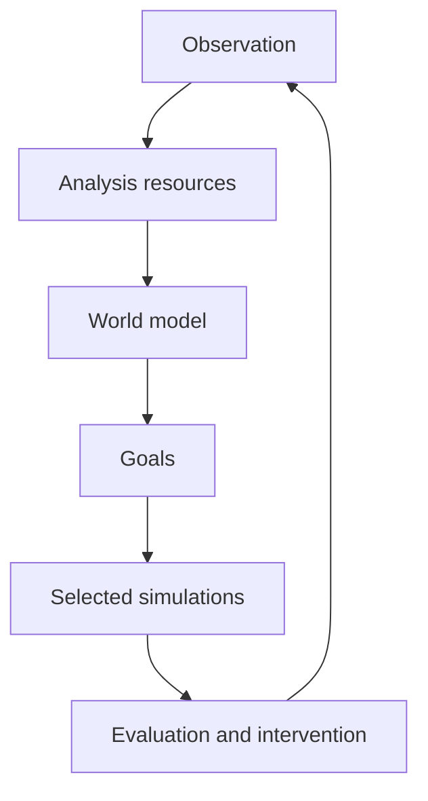
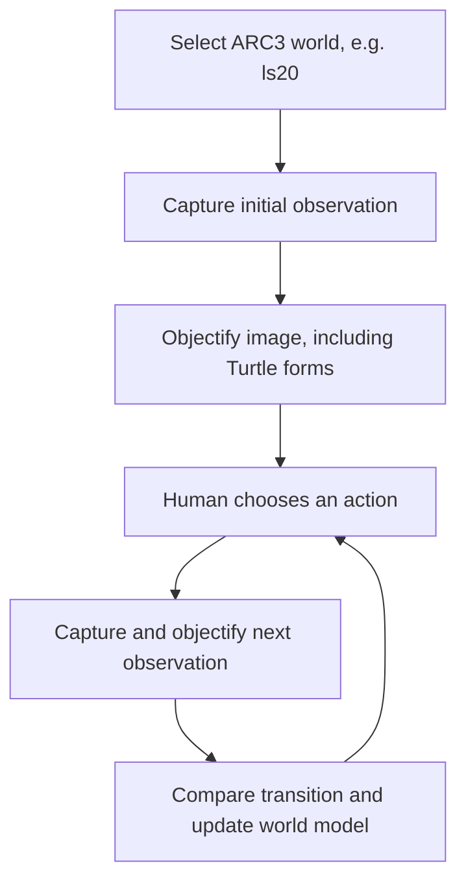

[← Back to README](../README.md)

# World Analysis Workbench

The workbench begins with observations. Processing resources enrich those
observations into progressively more useful internal representations. A learned
world model captures the entities, relationships, dynamics, constraints, and
uncertainties needed to reproduce or predict relevant behavior. Goals then
determine which possible transitions are worth simulating.

ARC3 is one adapter and evaluation environment. The same core can analyze a
visual puzzle, software interface, robot environment, scientific process, event
stream, or any other partially observed system.

## Core loop

The workbench does not attempt to simulate everything. Current goals,
hypotheses, uncertainty, and expected information gain determine which
simulations or real interventions should be considered.

## Central concepts

| Concept | Responsibility |
|---|---|
| Observation | Evidence received from outside the internal model |
| Information silo | Named, typed, versioned value with provenance and confidence |
| Analysis resource | Python, Prolog, LLM, human, or external processor that enriches silos |
| World model | Current executable hypothesis about state, entities, and dynamics |
| Goal | Supplied or inferred success criteria with priority |
| Simulation request | Goal-linked intervention to test against a world-model revision |
| Simulation result | Predicted state, goal scores, evidence, and confidence |
| Adapter | Boundary that translates a particular environment into observations and interventions |

`WorldAnalysisState` is append-only. A processor writes a new silo version
instead of silently replacing earlier evidence. Every result can cite exact
source versions such as `world/model:v3` or `observation/frame-17:v1`. This is
the general form of the debugger evidence trees already used by ARC3.

## Processing-resource sequence

The machine-readable operation contracts are in
[`world_workbench_operations.json`](../config/world_workbench_operations.json).

1. Observe a world.
2. Analyze an observation into entities, properties, relationships, and events.
3. Update the internal world model.
4. Identify or accept goals.
5. Select goal-relevant simulations.
6. Simulate candidate interventions.
7. Evaluate predicted outcomes against the goals.
8. Choose an intervention or request more observation.
9. Record the actual outcome as new evidence.

These are contracts rather than fixed implementations. A operation can be fulfilled
by Python, Prolog, an LLM, a human inspector, or an external process while
preserving the same typed inputs and outputs.

## ARC3 adapter

### First operating mode: observe a human playing

The first ARC3 workflow is apprenticeship rather than autonomous play. Its seven
top-level steps are saved as one workbench workflow. The human chooses each
action; the workbench watches the before/action/after sequence and tries to
understand the world.

“Objectify” is a reusable analysis stage. It extracts objects, assigns persistent
identities, records properties and relationships, generates one Turtle program
per object, renders those programs, and compares the renders with the source.
Turtle is therefore an executable object representation inside the workbench;
it is not the workbench's top-level workflow.

The runnable workflow is `arc3_human_observation` in
[`llm_workflows.json`](../config/llm_workflows.json). Each of its seven steps may
call a named subworkflow. The workflow desktop shows these as nested workflow
items; **Save and Run Selected** validates, expands, and executes them.

The adapter in [`python/worldworkbench/adapters/arc3.py`](../python/worldworkbench/adapters/arc3.py)
maps existing concepts without forcing them into the core:

| ARC3 application concept | Workbench concept |
|---|---|
| Game environment | Observed world |
| Rendered frame/state | Observation |
| Level | Episode or scenario |
| Action | Intervention |
| Object files and Turtle programs | Analysis silos and synchronized representations |
| Differences and similarities | Transition evidence |
| Candidate rule | World-dynamics hypothesis |
| Win state | Goal satisfaction evidence |
| Action tree | Analysis, intervention, and hypothesis history |

The existing `Arc3Runner`, terminal/web debugger, Prolog modules, action trees,
and Kaggle entry points remain application code. New domains should implement
their own observation and intervention adapters rather than depending on
`arc3_runner`.

The flagship demonstration will be an ARC3 solver assembled inside
MeTTaSymbolicLearnerWorkbench. Human-demonstration mode supplies actions for observational
learning; autonomous mode substitutes goal-directed simulation and action
selection while retaining the same objectification, transition, world-model,
evidence, and inspection subworkflows.

## Migration boundary

The first conversion is intentionally compatibility-preserving:

- `worldworkbench` is the new domain-neutral Python core.
- `WORLD_WORKBENCH_*` environment variables are preferred; existing `ARC3_*`
  variables remain supported.
- ARC3 stays installed with the `debugger`, `kaggle`, or `all` optional extras,
  rather than being a mandatory core dependency.
- Existing workflow manifests remain valid while domain-neutral manifests define
  the reusable contracts.

Later migrations can make the browser workflow editor operate directly on
`WorldAnalysisState` and can rename `action_trees` to a domain-neutral run store
without invalidating historical ARC3 evidence.
